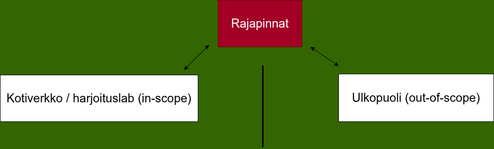
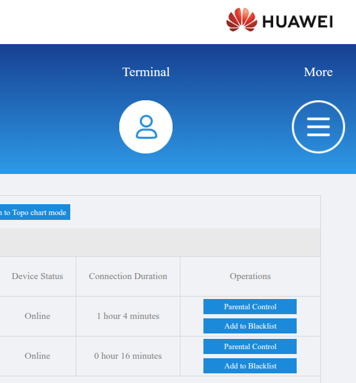
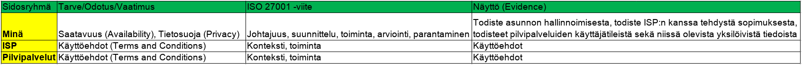

# h1 High Standards

*Tekijä: Aapo Tavio*

*Pohjana Tero Karvinen ja Lari Iso-Anttila 2026: Sovellusten hakkerointi ja haavoittuvuudet 2026 kevät, [Application hacking - 2026 Spring - English ICI012AS3AE-3001 and Finnish ICI012AS3A-3003](https://terokarvinen.com/application-hacking/#h1-high-standards-lari)*

**Opettajan alustusta tehtävästä:**

*"Kohdeympäristö on oma kotiverkko, jossa teet kurssin harjoituksia. “Organisaatio” on käytännössä oma taloutesi + oma IT-ympäristö (laitteet, reititin/Wi-Fi, pilvipalvelut, harjoituskoneet, mahdollinen NAS, jne.).*

*Tavoite: määritellä järkevä ISMS-soveltamisala, tunnistaa rajapinnat ja tuottaa dokumentaatio, joka olisi periaatteessa auditoitavissa (paperilla)."*

## a) Perustaso

**Tehtävä:** *Laadi ISMS-soveltamisala (scope) omalle kotiverkollesi ja opiskelulabillesi (½–1 sivu). Kuvaa vähintään:*

1. *Mitä kuuluu soveltamisalaan*

2. *Mitä rajaat ulos ja miksi*

3. *Keskeiset rajapinnat*

### Scope

**15.1.2026 Klo 19.15**

Soveltamisalaan perusinfrana kuului reititin, joka toimi myös WiFi liitäntäpisteenä (WiFi access point). Lisäksi laitteistoa kuului kannettava tietokone, kaksi virtuaalikonetta virtualbox-alustalla, toinen debian ja toinen kali käyttöjärjestelmällä, sekä puhelin.

Tiedoista soveltamisalaan kuuluivat kurssimateriaalit, omat muistiinpanot, Githubin repositorio opintojaksoon liittyen sekä tehtävienannot. Lisäksi kannettavan tietokoneen, virtuaalikoneiden, puhelimen, reitittimen ja Githubin tunnistautumisiin käytettävät tiedot kuuluivat mukaan.

Rajasin ulos toisen puhelimeni, koska kurssin näkökulmasta toinen puhelimeni on merkityksetön ja pidän sitä suurimman osan ajasta suljettuna. Pidän muutenkin useimmiten kyseisen puhelimen irti kotiverkostani, kun puhelin ei ole sammutettuna.

Toiset tietokoneeni rajasin myös ulos, sillä nekin ovat kurssin näkökulmasta merkityksettömiä. Kyseisiä tietokoneita pidän samalla tavalla useimmiten pois päältä, kuin toista puhelintakin.

Televisio oli yksi, joka jäi ulkopuolelle. Tämäkin laite ei ole relevantti kurssin suorituksen kannalta. Lisäksi TV:tä on vaikea muutoinkin hallita tarkasti, koska käyttäjän työkalupakissa tehtävät toiminnot TV:n ohjelmistoihin ovat hyvin rajattuja.

Pelikonsoli ja tulostin eivät tulleet mukaan, koska nekin ovat useimmiten pois päältä, eivät ole olennaisia ja lisäksi tulostin ei ole koskaan suoraan verkossa kiinni. Kiinnitän sen fyysisesti laitteeseen, kun haluan tulostaa jotakin.

### Rajapinnat

**15.1.2026 Klo 19.36**

Pilvipalveluista käytössäni ovat Microsoftin Github ja OneDrive, Haaga-Helian Moodle sekä Tero Karvisen Laksu. Tosin tiedostoja ei Laksussa käsitellä, mutta kai sen voisi lukea jossain määrin pilvipalveluihin.

Etäyhteyksiin kuuluivat SSH Githubiin sekä SSH kotiverkkoni sisällä. Kotiverkon ja julkisen verkon rajapinnassa soveltamisalaan otin reitittimen, johon kuuluvat esim. NAT (Network Address Translation) ja PAT (Port Address Translation). Lisäksi palomuurikerrokset otin huomioon.

Aiempien pilvipalveluiden toimittajien lisäksi toimittajina toimivat DNA, Hewlett Packard, Huawei, Samsung, Google, Oracle, Debian sekä OffSec.

**Kuva 1.** Rajapintojen suhde verkkoihin havainnollistettuna

### Näyttö

**15.1.2026 Klo 20.00**

**Tehtävänantoa:** *"Evidence-lisä (1–3 riviä per kohta):*  

*Kirjoita loppuun: “Mitä näyttöä voisin esittää?” (esim. reitittimen asetussivu kuvakaappauksena, laitelista, VM-listaus, repo-linkki, varmuuskopiointiasetukset)."*

Ensimmäiseksi todistin, että minulla on kyseiset laitteet verkossa. Kuvakaappaus on reitittimeni asetussivustosta, jossa oli kannettava tietokoneeni ja puhelimeni listattuna. Yksilöiviä tunnisteita kuten MAC- ja IP-osoitteita en halunnut laittaa tietoturvasyistä. Opettaja ilmoittikin tunnilla etukäteen, että yksilöiviä osoitteita ei tarvitse laittaa.

**Kuva 2.** Reitittimen asetussivusto päällä olevista laitteista

Lisäksi Github repositorioni URL on: [GitHub - apeeqq/sovellusten-hakkerointi-ja-haavoittuvuudet](https://github.com/apeeqq/sovellusten-hakkerointi-ja-haavoittuvuudet).

## b) Sidotaan Standardiin

**Tehtävä:** *"Tunnista vähintään 2 interested party -tahoa kotiverkkokontekstissa ja kirjoita kullekin:*

- *tarve/odotus/vaatimus (security/privacy/availability tms.)*

- *mihin ISO 27001 -vaatimusalueeseen se kytkeytyy (konteksti / johtajuus / suunnittelu / toiminta / arviointi / parantaminen)*

- *miten osoittaisit sen täyttymisen (evidence)*

*Tuotos (palautus):  
Taulukko"*

 

 

 

 

 

 

*Tätä dokumenttia saa kopioida ja muokata GNU General Public License (versio 3 tai uudempi) mukaisesti. http://www.gnu.org/licenses/gpl.html*

