# h2 Break & Unbreak

*Tekijä: Aapo Tavio*

*Pohjana Tero Karvinen ja Lari Iso-Anttila 2026: Sovellusten hakkerointi ja haavoittuvuudet 2026 kevät, [Application hacking - 2026 Spring - English ICI012AS3AE-3001 and Finnish ICI012AS3A-3003](https://terokarvinen.com/application-hacking/#h2-break--unbreak-tero)*

<br>

## Käytettävän ympäristön ominaisuudet

- Host
  
  - Host PC: HP Laptop 15s-eq3xxx
  
  - OS: Ubuntu 24.04.3 LTS
  
  - Processor: AMD Ryzen™ 7 5825U with Radeon™ Graphics × 16
  
  - Memory: 16.0 GiB
  
  - NIC: Realtek Semiconductor Co., 802.11ax Wireless
  
  - Architecture: x86_64
  
  - Firmware version: F.20
  
  - Kernel Version: Linux 6.14.0-37-generic

- Virtual Machine
  
  - OS: Kali GNU/Linux Rolling
  
  - Release: 2025.4
  
  - Kernel Version: Linux 6.18.5+kali-amd64
  
  - Architecture: x86-64
  
  - Hardware Vendor: innotek GmbH
  
  - Hardware Model: VirtualBox
  
  - Hardware Version: 1.2
  
  - Firmware Version: VirtualBox
  
  - Firmware Date: 2006-12-01
  
  - Browser: Mozilla Firefox ESR

 <br>

## x) Read/watch/listen and summarize. (In this x-subsection, you don't need to do tests on a computer; just reading or listening and a summary is enough. A few bullet points are sufficient for the summary.)

### Broken Access Control

- Pääsynhallinta (Access Control) asettaa rajat, joita tietty käyttäjä voi tiettyjä resursseja käyttää
  
  - Broken access control viittaa siis pääsynhallinnan rajojen huonoa käyttöä
    
    - Johtaa lopputulokseen, jossa käyttäjä pääsee käsiksi resursseihin, joihin hänen ei olisi tarkoitus päästä
  
  - Estäminen
    
    - Backend ja API koodin varmentaminen turvalliseksi

(OWASP Top 10 Team. URL: [A01 Broken Access Control - OWASP Top 10:2021](https://owasp.org/Top10/2021/A01_2021-Broken_Access_Control/index.html))

### Fuff

- Käytetään penetraatiotestauksessa

- Fuff-ohjelma on "sumutin" (fuzzer)

- Fuffilla voidaan löytää esim. piiloitettuja hakemistoja

(Karvinen 2023. URL: [Find Hidden Web Directories - Fuzz URLs with ffuf](https://terokarvinen.com/2023/fuzz-urls-find-hidden-directories/))

### Pääsynhallinnan haavoittuvuudet

- Vertikaalinen pääsynhallinta
  
  - Käyttäjien oikeuksissa hierarkinen jaottelu
  
  - Vertikaalisten oikeuksien hyökkäys (Vertical privilege escalation)

- Horisontaalinen pääsynhallinta
  
  - Käyttäjien samantasoinen toiminta hierarkiassa
    
    - Jokaisella omat resurssit joihin tietyllä käyttäjällä on oikeus
    
    - Horisontaalisten oikeuksien hyökkäys (Horizontal privilege escalation)

(PortSwigger. URL: [Access control vulnerabilities and privilege escalation | Web Security Academy](https://portswigger.net/web-security/access-control))

### Raportin kirjoittaminen

- Raportissa oltava
  
  - Mitä teit?
  
  - Mitä tapahtui?

- Täsmällinen

- Helppolukuinen

- Toistettava

- Lähteet

(Karvinen 2006. URL: [Raportin kirjoittaminen | Tero Karvinen](https://terokarvinen.com/2006/raportin-kirjoittaminen-4/))

<br>

## a) Break into 010-staff-only. See Karvinen 2024: [Hack'n Fix](https://terokarvinen.com/hack-n-fix/)

**21.1.2026 Klo 13.11**

Aloitin tehtävän lataamalla tehtäväpaketin virtuaalikoneeseeni komennolla

```bash
wget https://terokarvinen.com/hack-n-fix/teros-challenges.zip
```

Ja tämän jälkeen purkamalla sen komennolla

```bash
unzip teros-challenges.zip
```

Poistin internet-yhteyden tässä vaiheessa pois päältä GUI:stä.

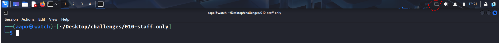

**Kuva 1.** Kuvassa punaisella alueella nähtävissä internet-yhteyden katkaisu

Ajoin "~/challenges/010-staff-only/" hakemistosta python-ohjelman komennolla

```bash
python3 staff-only.py
```

Minun piti saada selville admin-käyttäjän salasana katsomatta lähdekoodia. Aloitin menemällä localhost-osoitteeseen 127.0.0.1:5000.


**Kuva 2.** 010-staff-only tehtävän etusivu

Kokeilin ensimmäiseksi syöttää PIN-koodin "123" sivuston kenttään, joka lupasi paljastaa minulle salasanani. Sain salasanan "Somedude" vastaukseksi.

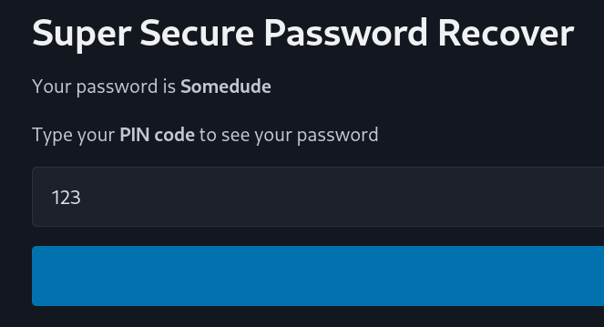

**Kuva 3.** Salasana palautettuna

<br>

### SQL-injektion yrityksiä

**21.1.2026 Klo 13.37**

Ajattelin koittaa ensimmäiseksi syöttää tekstikenttään:

```sql
SELECT password FROM passwords WHERE password='Somedude'; 
```

Päädyin ratkaisuun, koska ajattelin "password" taulun voivan olla olemassa, jos taulu "pins" oli myös olemassa.

Vastauksena oli "Please enter a number".

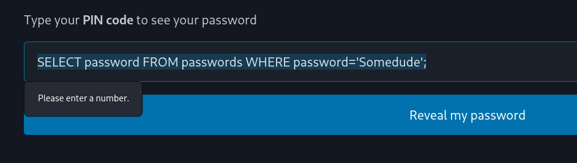

**Kuva 4.** Ensimmäinen epäonnistunut yritys

Kokeilin seuraavaa lauseketta.

```sql
SELECT password FROM pins WHERE password='Somedude';
```

Ajattelin tämän lausekkeen avulla selvittää, jos "pins" taulussa olisi jotain lisätietoa "Somedude" salasanasta.

Vastauksena jälleen "Please enter a number".


**Kuva 5.** Toinen epäonnistunut yritys

Tässä vaiheessa tajusin, että eihän aikaisemmat yritykset voineet toimia, koska syöttämäni lausekkeet menevät suoraan argumentiksi parametriin "pin". Eli tällä tavoin: "SELECT password FROM pins WHERE pin='SELECT password FROM passwords WHERE password='Somedude;';"

<br>

### Lisätiedon hakeminen ja lisää yrityksiä

Ajattelin tässä vaiheessa hakea lisätietoa netistä. Ensimmäiseksi halusin tietää, mitä tarkoittaa "?" (pelkkä kysymysmerkki) URL:ssa? Löysin muutaman sivun, joista sain tietoa sen olevan erottaja(separator).  

(Smartschan. URL: [What Does a Question Mark Mean in a URL?](https://altitudemarketing.com/blog/question-mark-url/))

Sekä merkki, jonka jälkeen voi syöttää arvoja parametreihin.

(Stack Exchange Inc. URL: [html - What is the meaning of ? (question mark) in a URL string? - Stack Overflow](https://stackoverflow.com/questions/33041449/what-is-the-meaning-of-question-mark-in-a-url-string))

**21.1.2026 Klo 14.14**

Seuraavaksi kokeilin seuraavanlaista URLia.

```url
http://127.0.0.1:5000?SELECT password FROM pins WHERE pin=' OR 1=1;-- #Apostrophe (') sulkee "pin" parametrin arvoksi tyhjän, OR jatkaa lauseketta, 1=1 antaa boolean arvoksi "tosi", puolipiste (;) päättää lausekkeen ja kaksi väliviivaa sekä välilyönti (-- ) merkkaavat loput kommentiksi
```

Ei tullut mitään uutta. Samanlainen aloitussivu, kuin navigoidessa localhost-osoitteeseen.

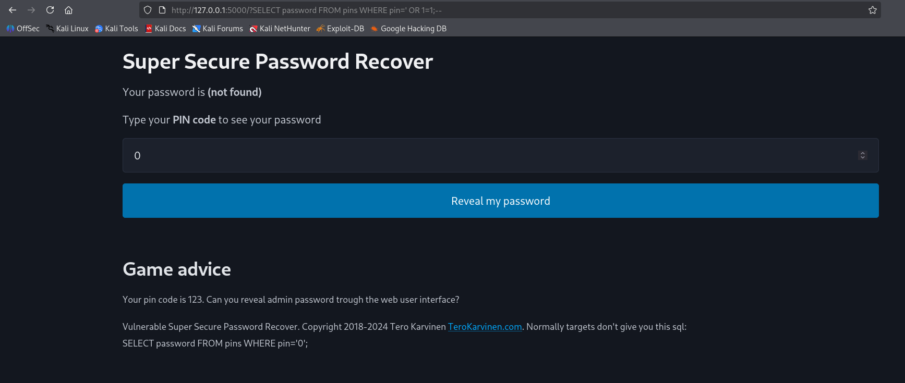

**Kuva 6.** Kolmas epäonnistunut yritys

Olisin tarvinnut toisinsanoen tehtävässä admin-käyttäjän pin-koodin, mutta minulla ei tullut mieleen miten sen saisin.

Kokeilin vielä muokata hieman syntaksia URL-riville.

```url
http://127.0.0.1:5000/?SELECT password FROM pins WHERE pin=' OR 1=1-- #Jätin puolipisteen pois


http://127.0.0.1:5000/?SELECT password FROM pins WHERE pin='' OR 1=1;-- #Laitoin yhden apostrophen lisää pin attribuutin parametriin
```

Tuloksena oli kuitenkin samanlaisia aloitussivuja.

<br>

### Ensimmäinen vinkki

**21.1.2026 Klo 16.02**

Olin saavuttanut tilanteen, jossa en osannut enää mitään järkevää vaihtoehtoa keksiä, vaikka tein portswiggeristä kaksi tehtävää ja katsoin lisätietoa SQL-injektiosta Youtube videoista. Turvauduin tässä vaiheessa ensimmäiseen vinkkiin sivulla [Hack'n Fix](https://terokarvinen.com/hack-n-fix/#tips-for-010-staff-only).

Vinkin avulla avasin Mozilla Firefoxin kehittäjätyökalut, josta näin koodinpätkän pin-koodin syöttämisestä.

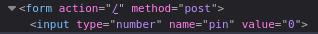

**Kuva 7.** Html koodia sivulta

Koodista ilmeni, että tyyppinä on numero, joka olikin selvää jo tilanteissa jolloin syötin kenttään kirjaimia tai heittomerkkejä. Suunnitelmani oli seuraavaksi muuttaa 'input type="number" muotoon 'type="text"', jolloin toivon mukaan olisin päässyt muokkaamaan syötettä enemmän.

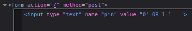

**Kuva 8.** Syötettä ja tyyppiä muokattu

Painoin "Reveal my password" painiketta, mutta edelleen sama oletussivu tuli esiin.

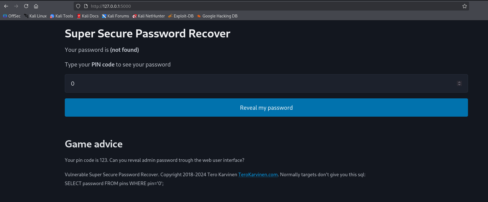

**Kuva 9.** Neljäs epäonnistunut yritys

Tajusin tämän jälkeen, että tämähän muutti vain paikallisesti html-koodia, eikä näin ollen muuttamisesta ollut mitään hyötyä.

**21.1.2026 Klo 17.19**

Koitin erilaista tekniikkaa network välilehden kautta kehittäjätyökaluilla. Vinkissä sanottiin, että kentän tyypin rajoitus voi olla vain UI:ssä, joten sen pystyisi ohittamaan kehittäjätyökaluilla. Kokeilin "Network" välilehden avulla muuttaa arvoa kohdassa "body" ja lähettää uudelleen POST-pyynnön.

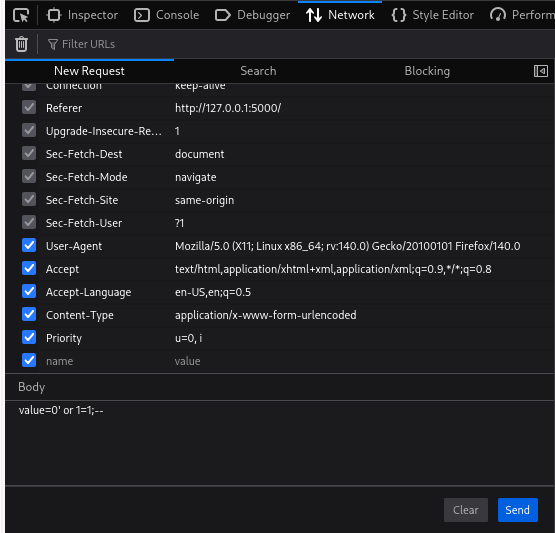

**Kuva 10.** Bodya muutettu

Edelleenkään ei mitään uutta.

Tässä kohtaa tajusin, että todennäköisesti URLia pitäisi kyllä muokata, koska numeraalinen tyyppi on sidottu vain laatikkoon, johon syötetään pin. En kuitenkaan keksinyt enempää ratkaisuja, joten turvauduin seuraaviin vinkkeihin.

<br>

### Toiset vinkit ja uusia yrityksiä

**22.1.2026 Klo 07.57**

En oikein saanut mitään irti seuraavista vinkeistä, mutta päätin koittaa uudenlaista tekniikkaa. Huomasin, että aikaisemmin olin yrittänyt "body" kohtaan "network" välilehdellä syöttää "value=0' or 1=1;--". Kuitenkin avatessa valikon, oletusarvona oli "pin=123", koska olin syöttänyt numerot "123" GUI:n kautta.

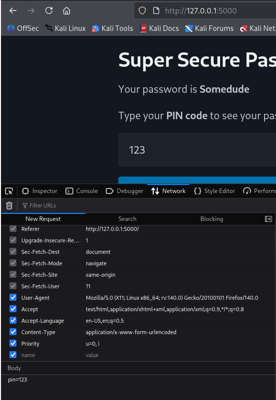

**Kuva 11.** Bodyssa pin=123

Kokeilin syöttää kohtaan "pin=' OR 1=1;--", jolloin pitäisi olla oikea attribuutti "pin". Painoin tämän jälkeen "send" kehittäjätyökaluista.

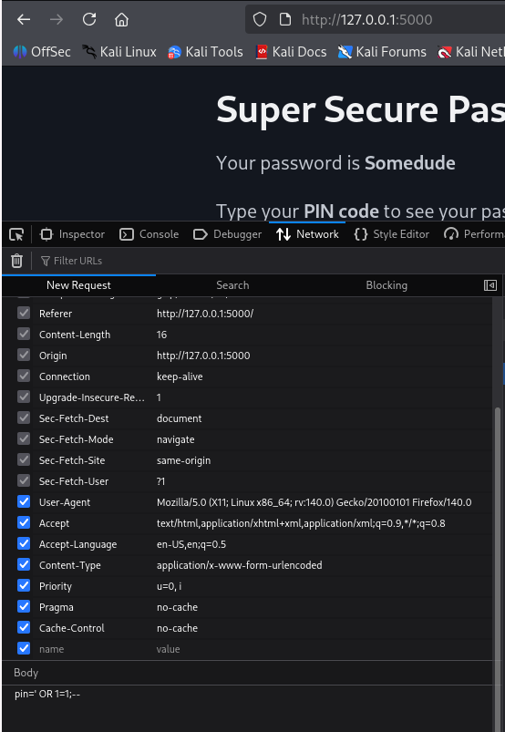

**Kuva 12.** Pin-attribuutilla ja uusilla arvoilla kyselyn tekeminen

Tämän jälkeen huomasin jotain eroavaisuutta "Initiator" kohdassa.

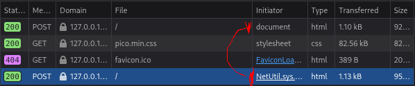

**Kuva  13.** Initiator sarakkeen teksti oli muuttunut ensimmäisestä kyselystä

Klikkasin oikealla hiiren painikkeella uutta ja muuttunutta POST-kyselyä sekä valitsin vaihtoehdon, jolla avasin sen uudessa välilehdessä. Sitten tulikin uutta ja kaivattua tietoa!

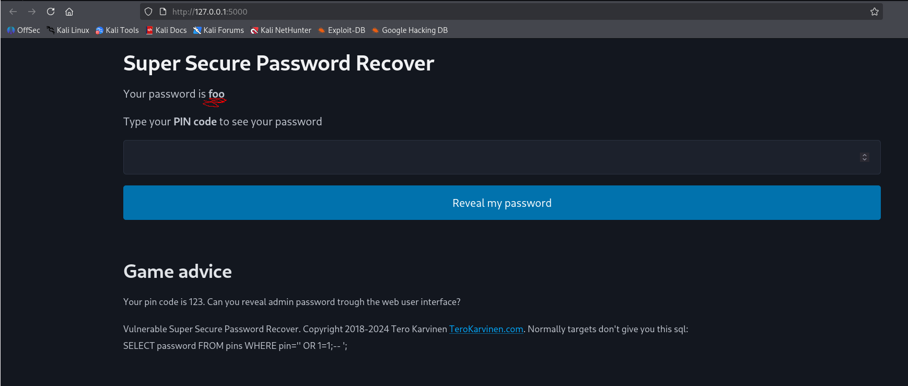

**Kuva 14.** Kuvassa uusi salasana "foo"

Olin saanut tällöin edes jotain uutta tietoa, mutta en ilmeisesti vieläkään admin käyttäjän salasanaa, koska siinä pitäisi tehtävän ohjeiden mukaan olla sana "SUPERADMIN". Ajattelin tässä vaiheessa tehtävän vinkkien perusteella, että tässä olisi voinut olla kyse "LIMIT" käytöstä SQL-kyselyssä, joka antaisi vain yhden vastauksen sarakkeesta.

Etsin tietoa lisää LIMIT:n käytöstä. Löysin GeeksforGeeksin artikkelin  

(URL: [How to Limit Query Results in SQL? - GeeksforGeeks](https://www.geeksforgeeks.org/sql/how-to-limit-query-results-in-sql/))  

sekä tehtävän vinkeissä olevan tiedon "LIMIT offset,count" ja "LIMIT 2,1".  

(URL: [Hack'n Fix](https://terokarvinen.com/hack-n-fix/#tips-for-010-staff-only))

<br>

### Ratkaisu

Tämän jälkeen päätin kokeilla alla olevan kuvan mukaista kyselyä.

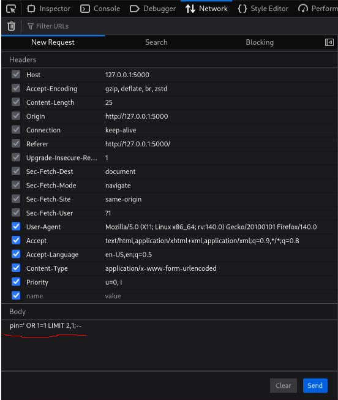

**Kuva 15.** Uusi kysely

Kyselyssä pin-attribuutin parametrin asetin tyhjäksi, jonka jälkeen lisäsin ehdon, joka on aina tosi sekä "LIMIT 2,1", joka antaisi yhden tietueen, mutta aloittaisi toisesta rivistä eteenpäin. Tällöin tulisi seuraavan rivin password kolumnin kohdalta oleva tietue vastauksena. Näin myös kävi ja admin-käyttäjän salasana oli ruudulla.

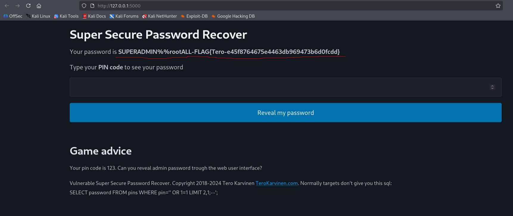

**Kuva 16.** Admin-käyttäjän salasana esillä

<br>

## b) Fix the 010-staff-only vulnerability from source code. Demonstrate with a test that your solution works.

**22.1.2026 Klo 08.45**

Aloitin avaamalla lähdekoodin ja huomasin sivuston olevan flask pohjainen.

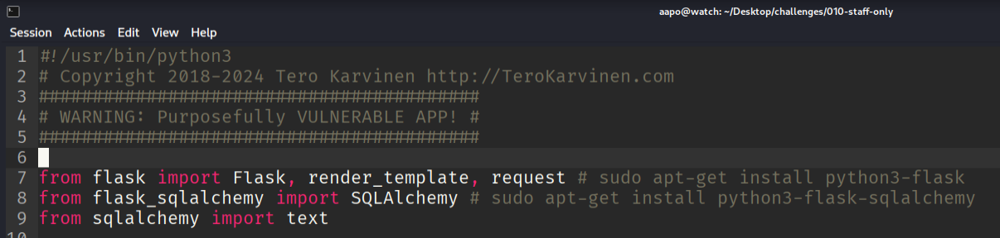

**Kuva 17.** Ohjelman lähdekoodia

Etsin tietoa, miten flaskilla ja sqlalchemyllä estetään SQL-injektiot.

**22.1.2026 Klo 14.13**

Etsin tietoa Flaskin ([Welcome to Flask &#8212; Flask Documentation (3.1.x)](https://flask.palletsprojects.com/en/stable/)) ja SQLAlchemyn ([SQLAlchemy](https://docs.sqlalchemy.org/en/20/tutorial/data_select.html#tutorial-selecting-data)) sivuilta, mutta en oikein löytänyt tai ainakaan saanut selvää vastausta näistä lähteistä, vaikka ne onkin pakko olla siellä.

Kysyin ChatGPT:ltä kysymyksiä

1. "what is db.session.execute"

2. "explain this from sqlalchemy import text 

        result = db.session.execute(
             text("SELECT * FROM users WHERE id = :id"),
             {"id": 1}
        )"

3. "are there always 2 parameters you can put to db.session.execute?"

4. "what is placeholder"

(Kielimalli: GPT-5. Generoitu: 22.1.2026.)

ChatGPT vastasi, että "db.session" on aktiivinen yhteys tietokantaan. Puolestaan "db.session.execute" tarkoitti SQL tai core lausekkeen ajamista. Tekoäly kertoi, että kysymyksen kaksi koodissa käytettiin parametrisoitua kyselyä, joka estää SQL-injektiot. Lisäksi vastauksessa kolmanteen kysymykseen todettiin, että aina ei ole tasan 2 parametriä kyseisessä funktiossa. Ensimmäiseksi tulisi lauseke, joka olisi pakollinen, jonka jälkeen parametrit, jotka olisivat vapaaehtoisia.

Neljänteen kysymykseen vastaus oli, että placeholder kertoo SQL-lausekkeessa, mihin arvo laitettaisiin myöhemmin. Lisäksi vastauksessa kerrottiin SQLAlchemyn placeholder olevan aina muodossa kaksoispiste ja muuttuja.

<br>

### Ensimmäiset yritykset haavoittuvuuden korjaamiseksi

**22.1.2026 Klo 14.52**

Löysinkin Flaskin sivustolta myös vähän ohjeita, joita voisin myös soveltaa. Ne tukivat myös mielestäni ChatGPT:n vastauksia.

(Pallets. URL: [SQLAlchemy in Flask &#8212; Flask Documentation (3.1.x)](https://flask.palletsprojects.com/en/stable/patterns/sqlalchemy/))

Alkuperäinen koodi on alla.

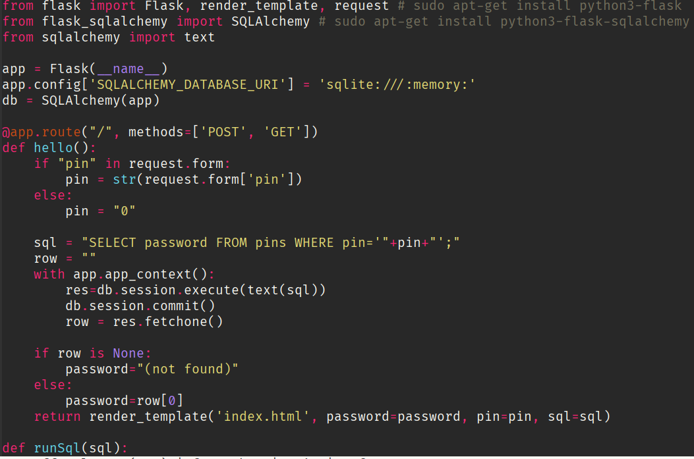

**Kuva 18.** Alkuperäinen koodi

Muutin koodia.

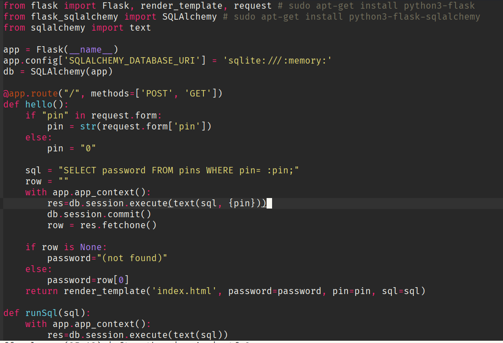

**Kuva 19.** Muutettua koodia

Kuvassa on muutettuna "sql" muuttujan lauseke parametrisoituun muotoon sekä "res" muuttujan tietokantakysely sisältämään "pin" muuttujan arvon.

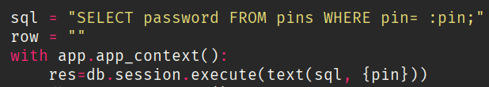

**Kuva 20.** Selkeämpi kuva muutoksista

Tämän jälkeen laitoin weppipalvelimen ylös ja surffasin tuttuun localhost-osoitteeseen http://127.0.0.1:5000/. Kuitenkin minulle tuli Server virhe.

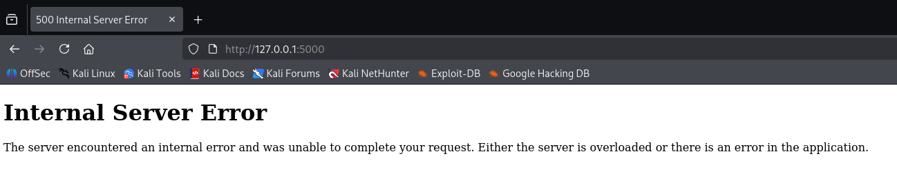

**Kuva 21.** Palvelin virhe localhost-osoitteessa

Menin katsomaan terminaaliin palvelimen ilmoituksia.

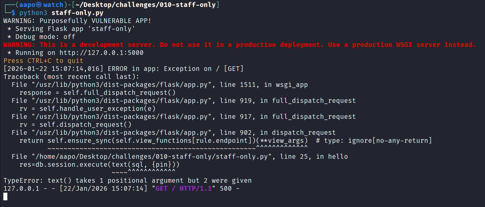

**Kuva 22.** Virhe 500 terminaalissa

Selkeästi virheenä oli "text()" attribuutin argumentit, joita se ottaisi vain yhden kahden sijasta.

Kokeilin erilaista tyyliä, jossa laitoin suoraan res-muuttujan tietokantakyselyyn merkkijonon, kuten netin esimerkeissä oli. Huomasin muuttaessani koodia samalla, että minulla taisi olla muutenkin syntaksivirheitä, joten sekin saattoi olla virheen taustalla.

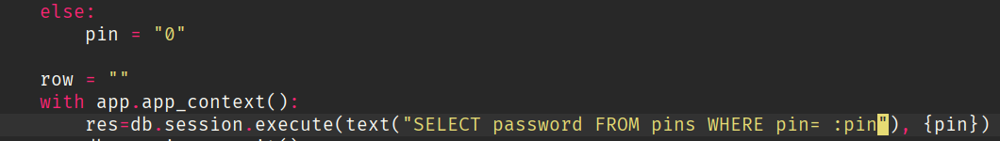

**Kuva 23.** Toisen kerran muutettua koodia

Laitoin uudestaan weppipalvelimen pystyyn ja tuttuun localhost-osoitteeseen, mutta samanlainen virheilmoitus.

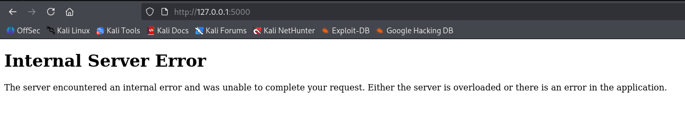

**Kuva 24.** Toinen samanlainen virheilmoitus selaimessa

Kuitenkin terminaalissa näkyi erilainen virheilmoitus tällä kertaa.

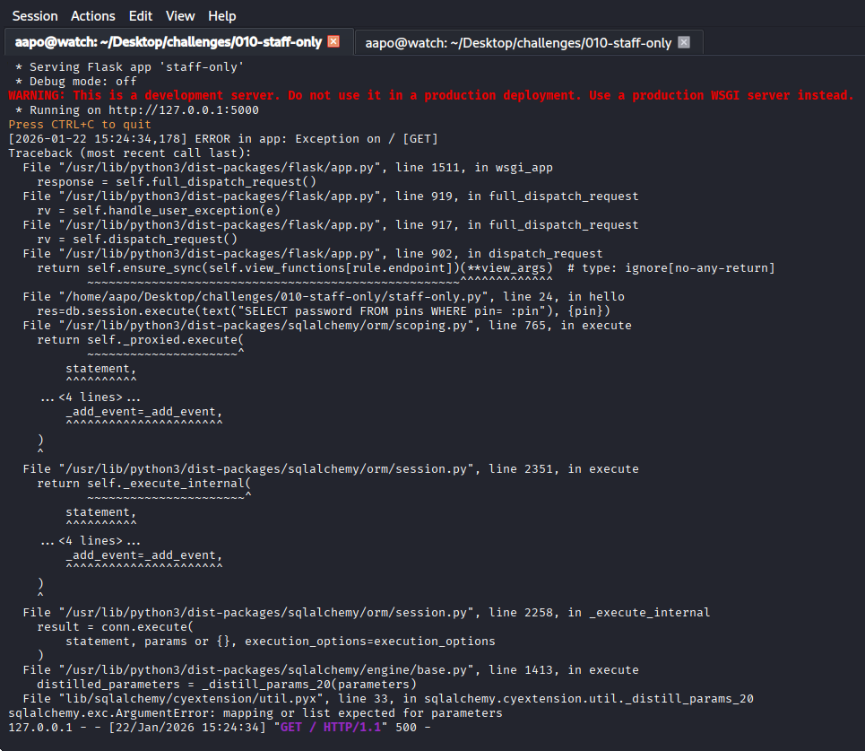

**Kuva 25.** Uudenlainen virheilmoitus

Koitin tällaista seuraavaksi.

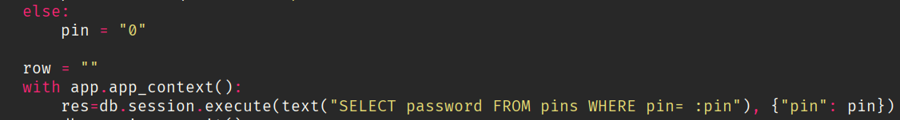

**Kuva 26.** Muutokset parametreissä

Kuitenkin samanlainen virheilmoitus selaimessa. Terminaalissa tuli taas uusi ilmoitus.

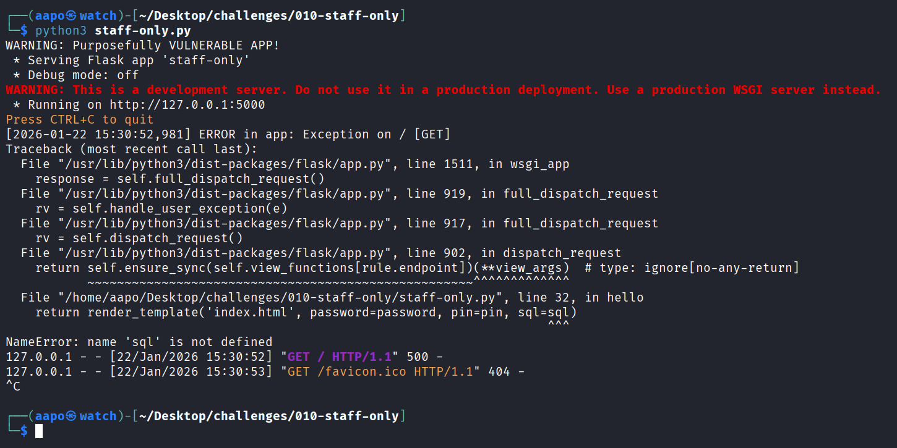

**Kuva 27.** Nimi sql ei oltu määritetty

<br>

### Ratkaisu ja haavoittuvuuden testaus

Ajattelin, että ongelma oli nyt siinä, että olin poistanut sql-muuttujan, mutta se oli toisessa paikassa vielä linkitettynä. Tuumasin sql-muuttujan palauttamisen olevan järkevin ratkaisu.

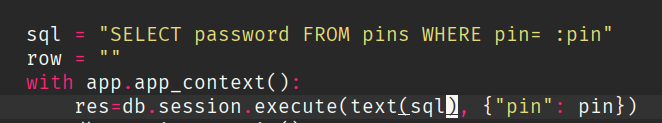

**Kuva 28.** Muuttuja sql otettuna takaisin käyttöön

Nyt tuli ainakin tuttu etusivu näkyviin.

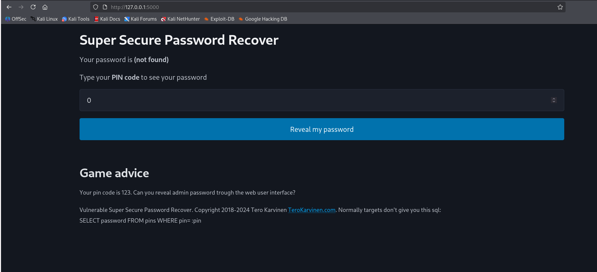

**Kuva 29.** Etusivu saatuna selaimeen uudelleen

Ainakin pin-koodina "123" ei anna suoraan numeroa UI:ssä takas sivun alalaidassa.

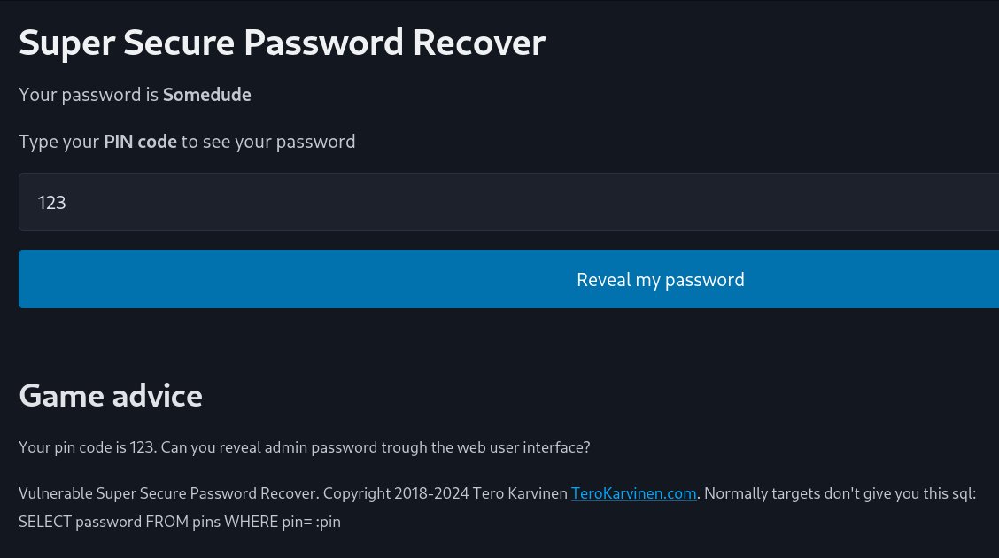

**Kuva 30.** Etusivulla erilainen toiminta kuin tehtävää aloittaessa

**22.1.2026 Klo 15.56**

Lähdin kokeilemaan samalla tavalla injektoimaan tietokantaa kuin aiemmin onnistuneella kerralla.

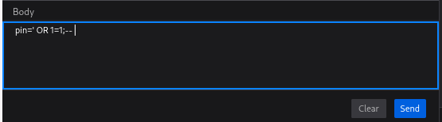

**Kuva 31.** SQL-injektio ilman "LIMIT" lauseketta

Vastaus oli lupaava.

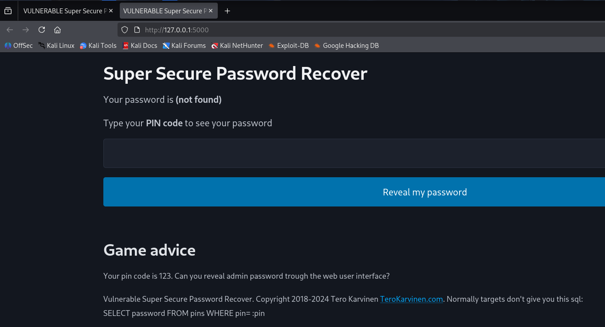

**Kuva 32.** Vastauksena ei tullut salasanoja

Vastauksessa aiemmin ollutta salasanaa "foo" ei ollut nyt nähtävissä.

Lähdin kokeilemaan samalla tavalla, kuin olin aiemmin saanut admin-käyttäjän salasanan selville.

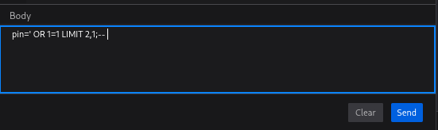

**Kuva 33.** Lausekkeella sai aiemmin admin-käyttäjän salasanan

Ja jälleen tuli toivottua vastausta.

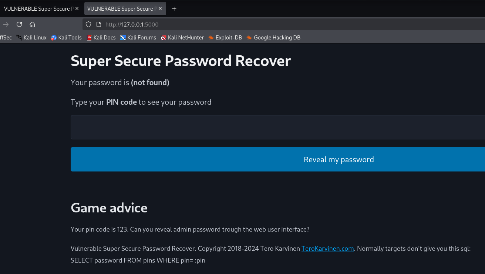

**Kuva 34.** Käyttäjän admin salasanaa ei tullut esille

Mitään salasanoja ei tullut taaskaan esille, joten voineen todeta haavoittuvuuden olevan paikattu.

<br>

## c) Solve dirfuzt-1 from the article Karvinen 2023: [Find Hidden Web Directories - Fuzz URLs with ffuf](https://terokarvinen.com/2023/fuzz-urls-find-hidden-directories/). This helps in solving 020-your-eyes-only.

**22.1.2026 Klo 16.41**

Aloitin lataamalla tehtäväpaketin komennolla

```bash
wget https://terokarvinen.com/2023/fuzz-urls-find-hidden-directories/dirfuzt-0
```

Laitoin tiedoston ajettavaksi sekä ajoin tiedoston.

```bash
chmod u+x dirfuzt-0 #Lisää käyttäjälle oikeuden ajaa tiedosto


./dirfuzt-0 #Ajaa tiedoston dirfuzt-0
```

Menin Firefoxilla osoitteeseen 127.0.0.2:8000.

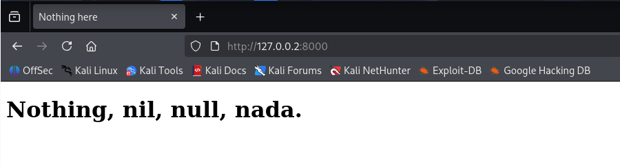

**Kuva 35.** Tehtävän etusivu selaimessa

Kalissa oli valmiiksi ffuf-ohjelma, joten sitä ei tarvinnut asentaa erikseen. Sanalistan latasin Daniel Miesslerin SecLists repositoriosta komennolla

```bash
wget https://raw.githubusercontent.com/danielmiessler/SecLists/master/Discovery/Web-Content/common.txt
```

Tässä vaiheessa irroitin virtuaalikoneeni internetistä.

Lähdin ajamaan ffufia kohdeosoitteeseen komennolla

```bash
ffuf -w common.txt -u http://127.0.0.2:8000/FUZZ #Valinta -w common.txt valitsee käytettävän sanakirjan
                                                   #Valinta -u ja URL/FUZZ kertoo kohde URLin ja syöttää sanakirjan sanoja kohtaan "FUZZ"
```

(Valintojen lähteet ffuf:n virallisesta manuaalista Kalilla. Komento "man ffuf")

("FUZZ" URL:n perässä lähteenä Karvinen 2023. URL: [Find Hidden Web Directories - Fuzz URLs with ffuf](https://terokarvinen.com/2023/fuzz-urls-find-hidden-directories/))

Suodatin tuloksia komennolla

```bash
ffuf -w common.txt -u http://127.0.0.2:8000/FUZZ -fs 132 #Valinta -fs suodattaa kaikki 132B pituiset vastaukset pois (Lähteenä yllä oleva Karvisen artikkeli)
```

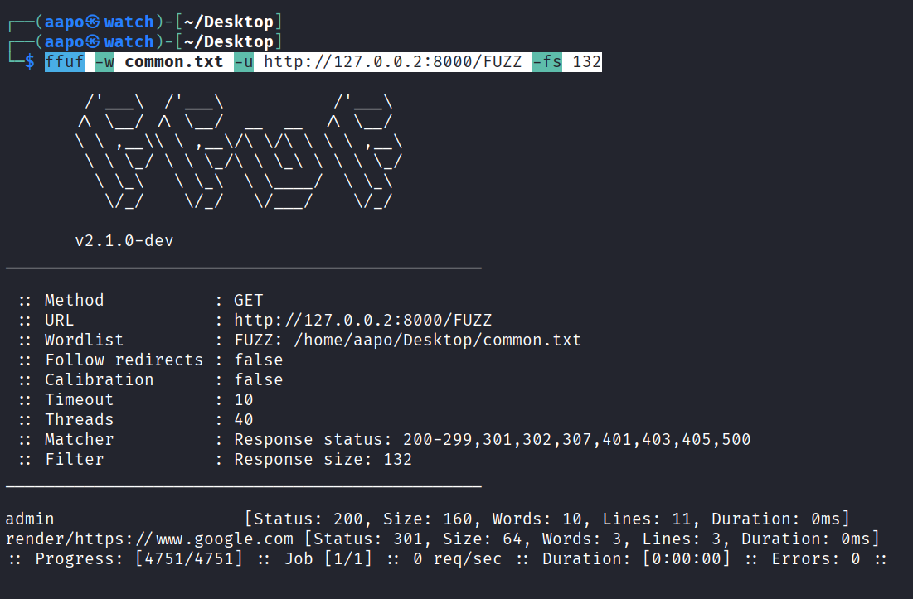

**Kuva 36.** Osuma admin polusta

Löysin "admin" polun sivulta, joten menin selaimella sinne.

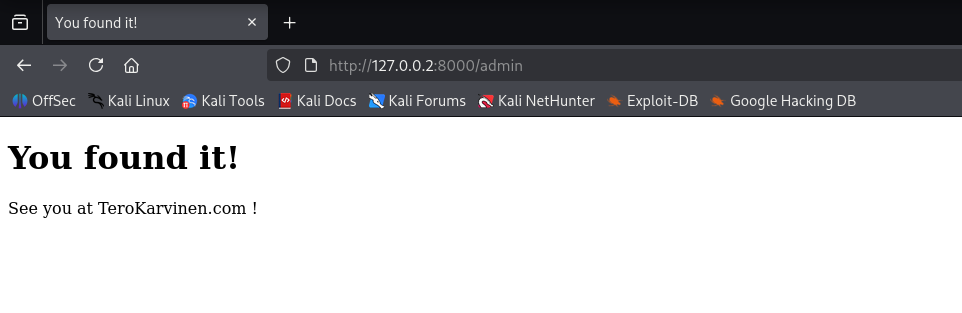

**Kuva 37.** Selaimesta sai vahvistettua onnistumisen

<br>

### Ffufin käyttö ilman ohjeita

**22.1.2026 Klo 17.23**

Kokeilin seuraavaksi löytää sivulta [Find Hidden Web Directories - Fuzz URLs with ffuf](https://terokarvinen.com/2023/fuzz-urls-find-hidden-directories/) ladattavan tiedoston "dirfutz-1" weppipalvelimelta adminiin ja versionhallintaan liittyvät sivut.

Lataamisen jälkeen laitoin taas internet-yhteyden pois päältä, laitoin tiedoston ajettavaksi ja ajoin sen.

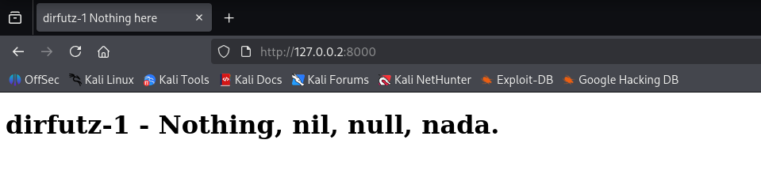

**Kuva 38.** Aloitussivu selaimessa tiedoston ajamisen jälkeen

Ensimmäiseksi ajoin ilman filttereitä, kuten aikaisemminkin.

```bash
ffuf -w common.txt -u http://127.0.0.2:8000/FUZZ
```

Osa vastauksesta alla.

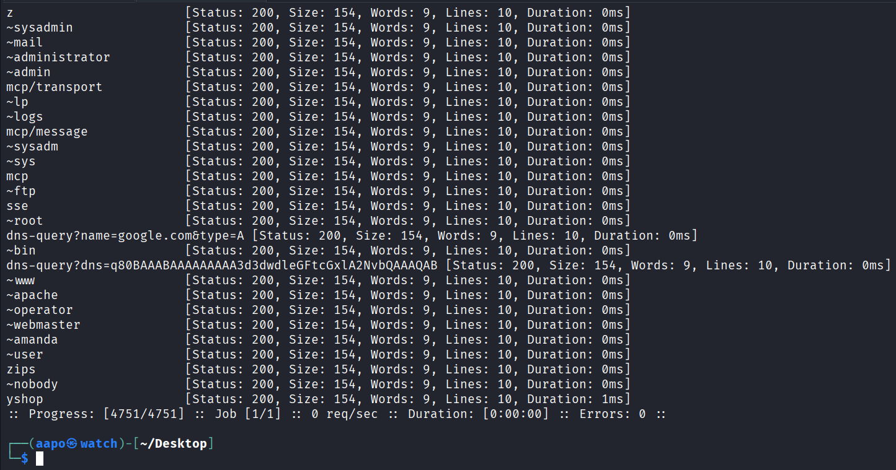

**Kuva 39.** Vastaus ffufin komentoon ilman filttereitä

Yhteneväisiä tekijöitä vastauksissa oli selkeästi tilakoodina 200, kokona 154B, sanoja 9 sekä rivejä 10. Aikaa en ottanut edes huomioon, koska Karvinenkin totesi sivuillaan sen olevan muu kuin ensimmäinen prioriteetti indikaattoreista.

(Karvinen 2023. [Find Hidden Web Directories - Fuzz URLs with ffuf](https://terokarvinen.com/2023/fuzz-urls-find-hidden-directories/))

Lähdin kokeilemaan samalla tavalla kuin aiemmin. Suodatin vastaukset koon mukaan ja poissuljin kaikki 154 tavua olevat vastaukset. Komentona oli siis

```bash
ffuf -w common.txt -u http://127.0.0.2:8000/FUZZ -fs 154
```

Vastauksena taisi tulla haluamani vastaus adminin ja versionhallinnan sivuista.

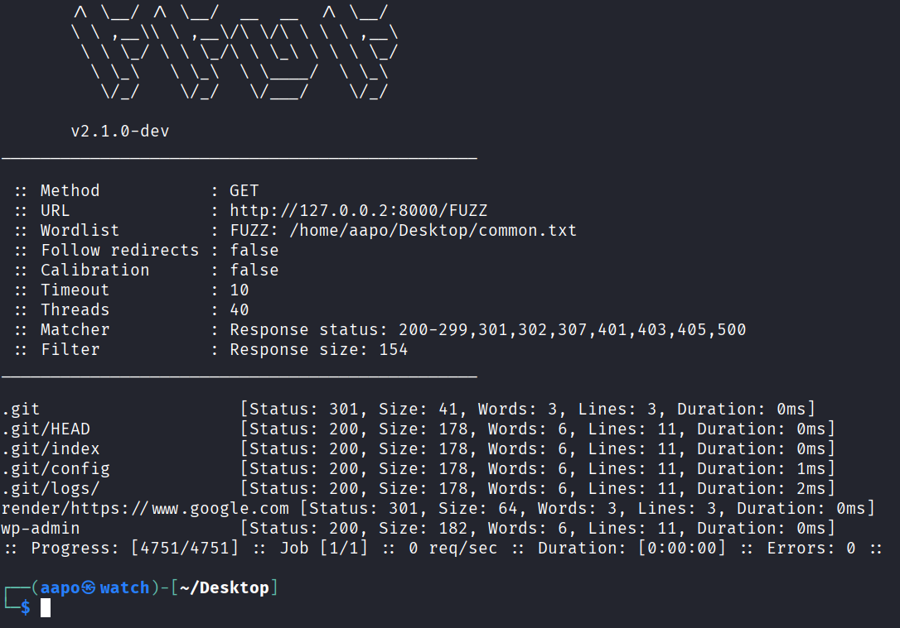

**Kuva 40.** Tulos suodattamisella

Päättelisin "wp-admin" olevan admin sivusto ja ".git" sivustot olisivat versionhallintaan liittyviä sivustoja, koska git on versionhallintaan laajasti käytetty ohjelma.

Navigoin ensin admin sivuille.

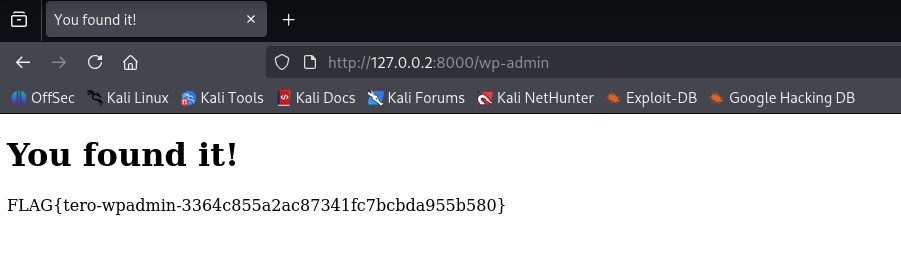

**Kuva 41.** Admin sivuston lippu

Tämän jälkeen menin versionhallinnan sivulle.

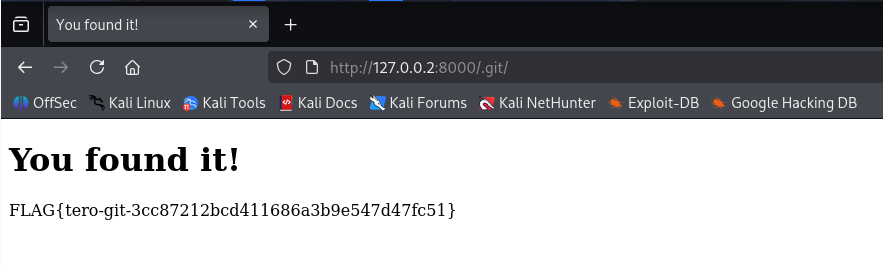

**Kuva 42.** Versionhallinta sivuston lippu

Tämä tehtävä oli paketissa.

<br>

## d) Break into 020-your-eyes-only. See Karvinen 2024: [Hack'n Fix](https://terokarvinen.com/hack-n-fix/)

**22.1.2026 Klo 18.36**

Aloitin tekemällä virtuaaliympäristön komennolla

```bash
virtualenv virtualenv/ -p python3 --system-site-packages #
```

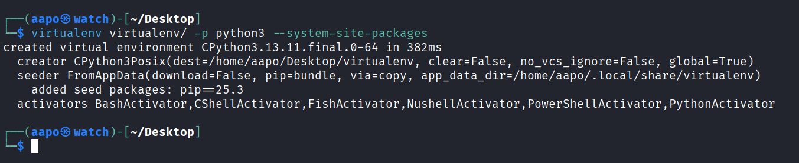

**Kuva 43.** Virtuaaliympäristön tekeminen ja sen prosessi

Aktivoin virtuaaliympäristön komennolla

```bash
source virtualenv/bin/activate
```

Laitoin internet-yhteyden takaisin päälle, koska minun piti ladata django.

Latasin djangon opettajan ohjeiden mukaan.

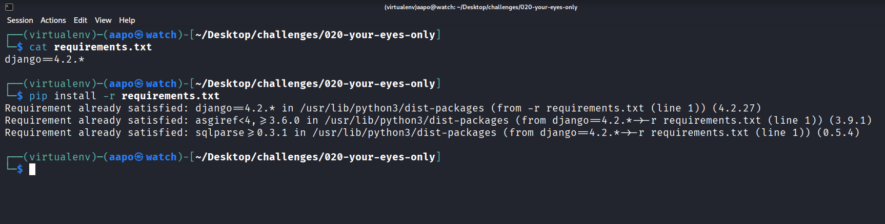

**Kuva 44.** Tekstin tarkastaminen tiedostosta ja sitä hyödyntäen djangon lataus

Huomasin kuitenkin vastauksesta, että ilmeisesti django olisi ollut jo valmiina virtuaalikoneellani. Tarkastin djangon olemassaolon.

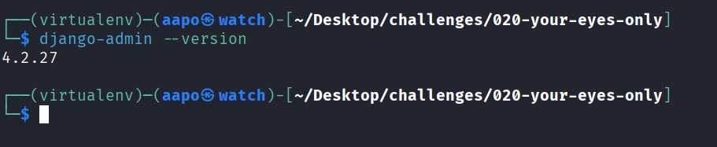

**Kuva 45.** Djangon version tulostaminen

Näytti olevan kunnossa.

Seuraavana oli komennot

```bash
cd logtin
./manage.py makemigrations; ./manage.py migrate #Päivittää tietokannan
```

(Lähde: Karvinen 2023. URL: [Hack'n Fix](https://terokarvinen.com/hack-n-fix/#020---your-eyes-only))

Lisäsin vielä alle kuvan tietokantojen päivittämisestä varmuuden vuoksi.

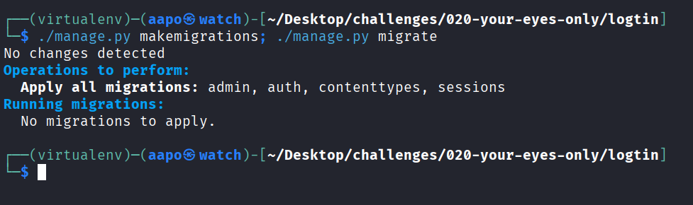

**Kuva 46.** Tietokannan päivitys

Tässä vaiheessa internet-yhteys katkaistiin jälleen.

Edelleen annoin komennon

```bash
./manage.py runserver #Ajaa tiedoston manage.py, joka sisältää weppipalvelimen
```

<br>

### Tiedustelu

**22.1.2026 Klo 19.03**

Menin katsomaan selaimella weppipalvelimen tarjoamaa etusivua.

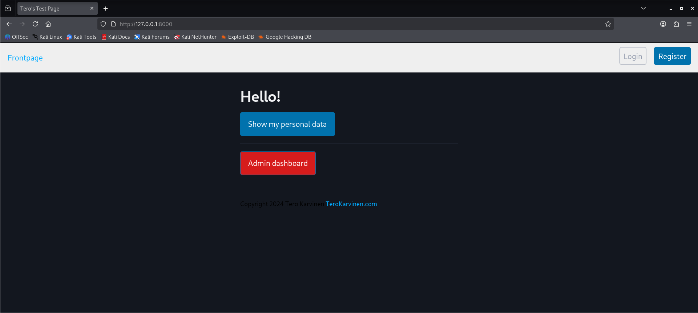

**Kuva 47.** Kohdesivuston etusivu

Ajattelin tässä kohtaa aloittaa tiedustelun ffuf-ohjelmalla tutulla komennolla. Vain ip-osoitetta piti muuttaa aikaisemmasta.

```bash
ffuf -w common.txt -u http://127.0.0.1:8000/FUZZ
```

Ffufin ajaminen antoi hieman lisäinfoa.

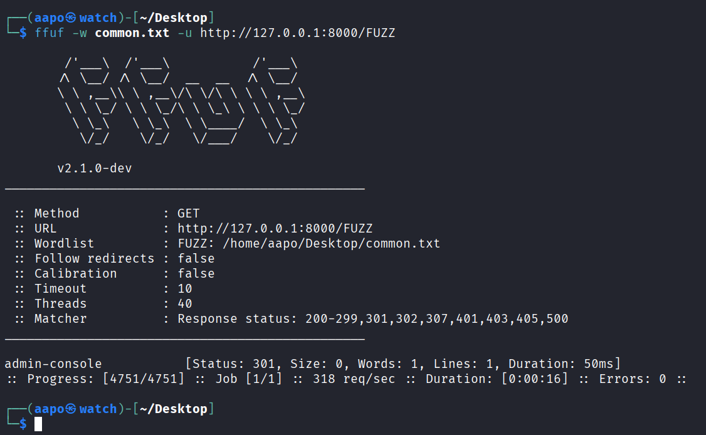

**Kuva 48.** Ffufin antama tulos

Lähdin navigoimaan osoitteeseen 127.0.0.1:8000/admin-console.

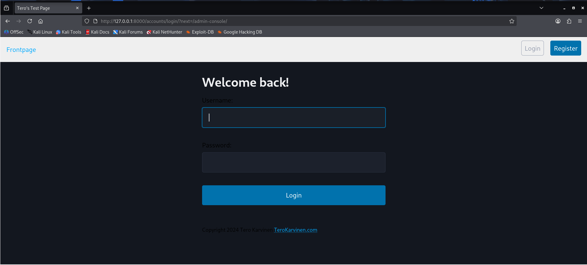

**Kuva 49.** Admin-console selaimessa

Löysin sivuston html-koodista mielenkiintoisen rivin.

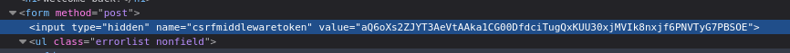

**Kuva 50.** Html-koodia sivulta admin-console

Nimen kohdalla lukee jotain tokenista, joka voisi tarkoittaa tunnistamiseen käytettäviä evästeitä. Lähdin hakemaan netistä tietoa.

Csrfmiddlewaretoken on ilmeisesti djangon luoma varmiste, joka estäisi cross-site request forgery hyökkäyksen. Tokenilla tunnistettaisiin, että viesti tulee lähettäjältä, jolta sen kuuluisikin tulla.

(GeeksforGeeks. URL: [CSRF token in Django - GeeksforGeeks](https://www.geeksforgeeks.org/python/csrf-token-in-django/).)

Menin katsomaan kehittäjätyökaluilla enemmän, josta löysin jälleen tietoja, joita lähetetään POST-pyyntönä sivustolle.

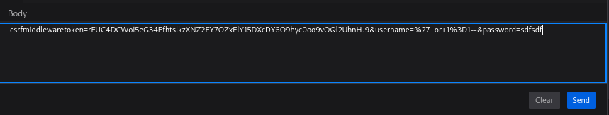

**Kuva 51.** Kehittäjätyökalujen network välilehden tietoja kohdassa body

<br>

### Tunkeutumisyrityksiä ja ratkaisu

Ajattelin ensiksi poistaa tokenin kokonaan ja kokeilla siten SQL-injektiota.

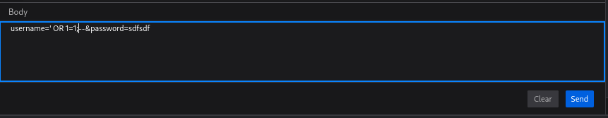

**Kuva 52.** Payload sivustolle

Sain virheilmoituksen tokenin puuttumisesta.

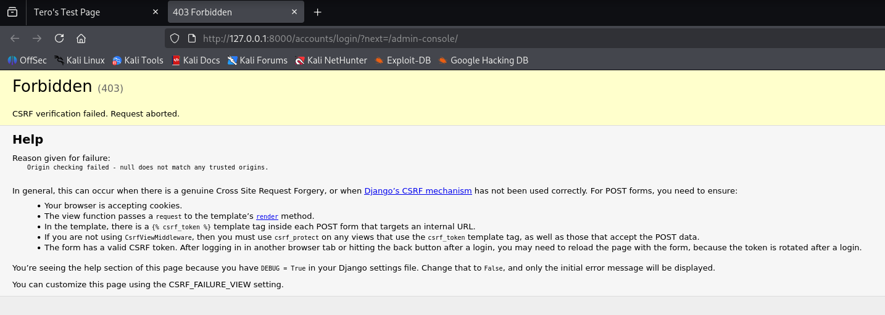

**Kuva 53.** Virheilmoitus 403

Yritin erilaisia tekniikoita, kuten syöttää kaikille kirjautumissivuille "username" kohtaan admin' or 1=1;--. Toinen jota koitin joka paikkaan oli Admin' or 1=1;-- sekä poistelin välillä csrf-tokenin pyynnöstä. Lopulta tajusin sivun oikeassa yläreunassa olevan "register" painike.

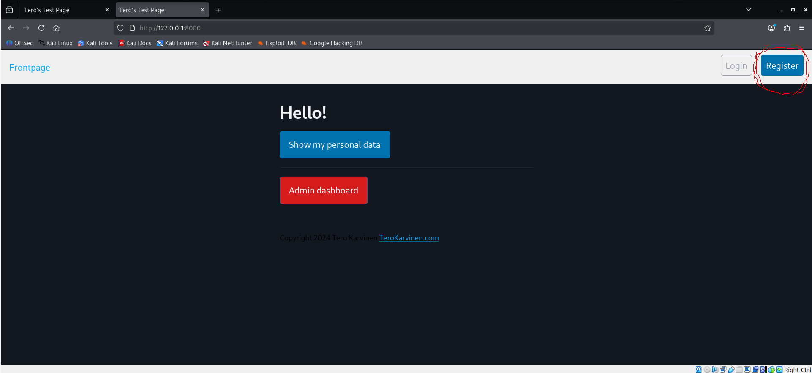

**Kuva 54.** Rekisteröintipainike sivun oikeassa yläreunassa

Tein käyttäjän ja tutkin sivuja. "Show my personal data" painikkeen takaa löytyi tietoja.

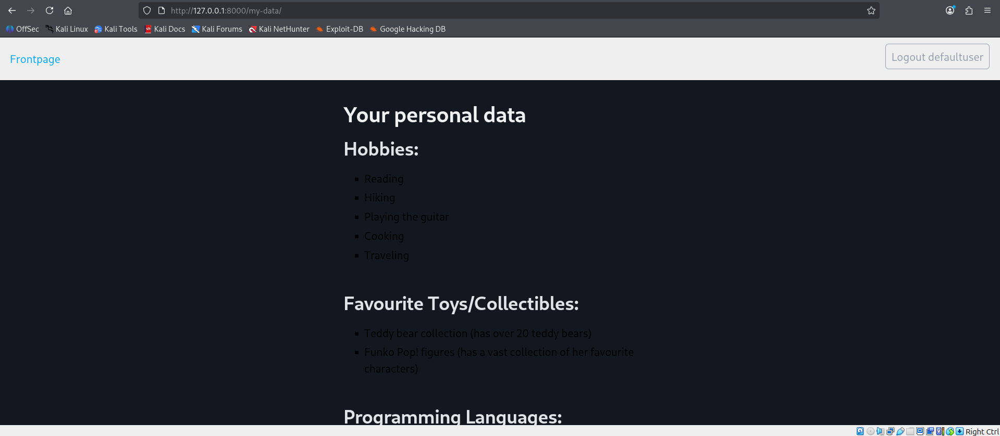

**Kuva 55.** Tietoja sivuilta kirjautuneena käyttäjänä

Päätin kokeilla sisään kirjautuneena mennä osoitteeseen 127.0.0.1:8000/admin-console, josta löysinkin admin-käyttäjän piilotetun sivun.

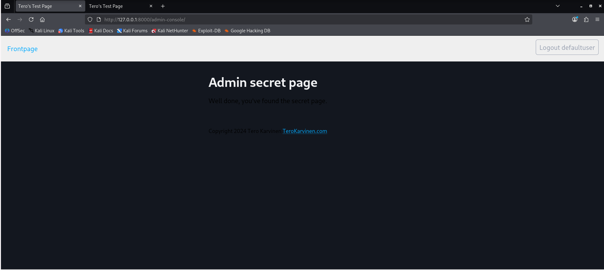

**Kuva 56.** Admin-käyttäjän murrettu sivu

En tiedä tarkalleen ottaen, miksi pääsin sisään admin-käyttäjän sivuille luomallani tunnuksella? Olin kuitenkin melko varma, että se johtui evästeistä ja vielä erittäin todennäköisesti aikaisemmin mainitsemastani csrf-tokenista.

<br>

## e) Fix the 020-your-eyes-only vulnerability. Demonstrate with a test that your solution works.

**23.1.2026 Klo 08.12**

Lähdin ensiksi tarkastelemaan lähdekoodia, joka näytti tältä.

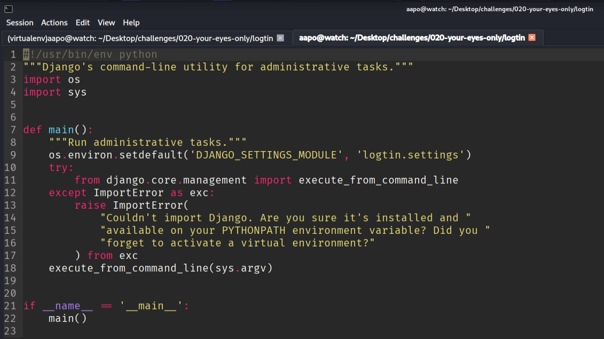

**Kuva 57.** Tehtävän 020-your-eyes-only lähdekoodi tiedostossa manage.py

Jatkoin edelleen etsimään djangon sivuilta tietoa, miten korjaisin koodin turvalliseksi?

**23.1.2026 Klo 09.49**

Tutkittuani lähes kaksi tuntia djangon ohjeita ja lisäksi kyselemällä ChatGPT:ltä sekä hakemalla DuckDuckGo hakukoneesta vastauksia, taisin saada vihdoin vastauksen.

(Django. URL: [Django](https://www.djangoproject.com/))

(ChatGPT. GPT-5 mini. Ratkaisevat syötteet: "what means from django.views.generic import TemplateView" ja "what is from django.contrib.auth.mixins import UserPassesTestMixin".)

DuckDuckGo:n perusteella en löytänyt juuri mitään vastauksia. Itse asiassa en osannut tulkita djangon sivujakaan kunnolla, koska mielestäni siellä oli monimutkaisesti ilmoitettu kaikki, koska minulla ei ollut aikaisempaa kokemusta sekä vaihtoehtoja SQL-kyselyihin oli mielestäni monia.

ChatGPT vastasi "django.views.generic" olevan moduuli, joka sisältää ennalta rakennetun luokka perusteiset näkymät (pre-built class-based views, CBVs). TemplateView puolestaan olisi tekoälyn mukaan luokka, joka renderöi/muuntaa mallipohjaksi helposti.

Puolestaan "django.contrib.auth.mixins" tekoäly ilmaisi olevan moduuli, joka tarjoaa mixinit (mixins) tunnistautumiseen. Mixinit olisivat apuluokkia tukemaan näkymiä (views). Lisäksi "UserPassesTestMixin" oli mixin, jolla voidaan rajoittaa pääsyä näkymään (view) omatekoisilla ehdoilla.

Tulkinta tekoälyn vastauksista oli hieman sekava, koska kääntäminen oli melko haastavaa englannista suomeksi.

Joka tapauksessa tiedostopolussa /home/aapo/Desktop/challenges/020-your-eyes-only/logtin/hats/views.py oleva tiedosto näytti alla olevan kuvan mukaiselta.

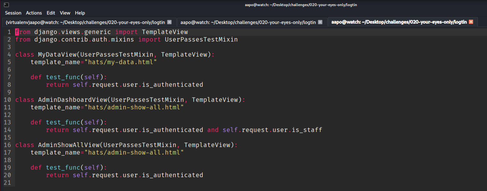

**Kuva 58.** Tiedostossa näkyi aikaisemmin avaamiani käsitteitä

<br>

### Ratkaisu ja testaus

**23.1.2026 Klo 10.16**

Suunnitelmani oli muuttaa "AdminShowAllView" kohtaan samanlaiset ehdot kuin kohtaan "AdminDashboardView".

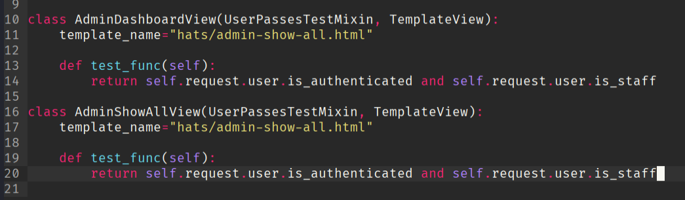

**Kuva 59.** Tiedosto views.py muutettuna

Lisäsin siis "and self.request.user.is_staff".

Sitten laitoin uudelleen weppipalvelimen ylös ja menin katsomaan, pääsinkö tekemälläni käyttäjällä enää admin-käyttäjän sivuille.

En päässyt sivuille, joten muutos toimi!

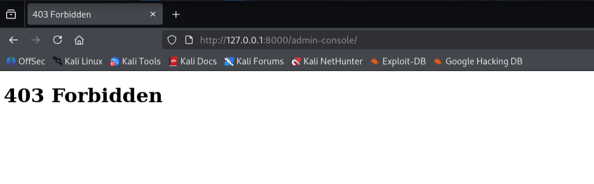

**Kuva 60.** Aiemmin haavoittuneena olleelle sivulle ei enää päässyt

Tehtävät olivat tässä vaiheessa paketissa, mutta toteaisin vielä mielestäni ratkaisujen olevan hieman kyseenalaisia, koska ratkaisut perustuivat paljolti tekoälyyn. Oman näkemykseni, ja toki tekoälyn kehittäjienkin mukaan, tiedot tulisi tarkistaa muista lähteistä. En löytänyt taikka en osannut tulkita ratkaisun kannalta oleellisia asioita muista lähteistä, tehtävän tekemiseen varatun ajan puitteissa. Tällöin nämä ratkaisut riittivät tähän paikkaan.

<br>

## Loppupohdintaa

Haavoittuvuuksien yleisestä esiintyvyydestä, kuvittelisin "010-staff-only" tehtävän sisältävän SQL-injektio haavoittuvuuden voivan ilmetä kaikissa sivuissa, joissa käyttäjän syötettä otetaan vastaan ja sen perusteella tehdään tietokantakyselyitä. Hyökkäyksen estämiseksi ainoa vaihtoehto mielestäni on tehdä käytettävän tietokanta-alustan ohjeiden mukaiset ratkaisut.

Tehtävän "020-your-eyes-only" haavoittuvuus oli puolestaan käyttäjän tunnistamiseen liittyvistä virheistä koostuva. Tämä voisi mielestäni olla millaisessa tahansa sovelluksessa, jos käyttöoikeudet ovat asetettu väärin. Tässäkin tapauksessa näen ainoan vaihtoehdon suojautumiseen olevan alustan oikeaoppinen käyttö. Lisäksi on toki tiedettävä, mitä tämä asia tekee ja kenellä on siihen pääsy?

Johdonmukaisella testauksella voidaan välttyä monelta ongelmalta ennen kuin haavoittuvuus aiheuttaa suurempaa vahinkoa.

<br>

<br>

## Lähteet

ChatGPT. Kielimalli GPT-5. Generoitu 22.1.2026. Syötteet b-tehtävässä.

ChatGPT. Kielimalli GPT-5 mini. Generoitu 23.1.2026. Syötteet e-tehtävässä.

Ffuf virallinen manuaali. Kali Linux. Komento "man ffuf". Luettu: 22.1.2026.

GeeksforGeeks. 23.7.2025. How to Limit Query Results in SQL?. Luettavissa: [How to Limit Query Results in SQL? - GeeksforGeeks](https://www.geeksforgeeks.org/sql/how-to-limit-query-results-in-sql/). Luettu: 22.1.2026.

GeeksforGeeks. 5.8.2025. CSRF token in Django. Luettavissa: [CSRF token in Django - GeeksforGeeks](https://www.geeksforgeeks.org/python/csrf-token-in-django/). Luettu: 22.1.2026.

Karvinen, T. 30.10.2024. Hack'n Fix. Luettavissa: [Hack'n Fix](https://terokarvinen.com/hack-n-fix/#tips-for-010-staff-only). Luettu: 21.1.2026.

Karvinen, T. 4.6.2006. Raportin kirjoittaminen. Luettavissa: [Raportin kirjoittaminen | Tero Karvinen](https://terokarvinen.com/2006/raportin-kirjoittaminen-4/). Luettu: 20.1.2026.

Karvinen, T. 10.5.2023. Find Hidden Web Directories - Fuzz URLs with ffuf. Luettavissa: [Find Hidden Web Directories - Fuzz URLs with ffuf](https://terokarvinen.com/2023/fuzz-urls-find-hidden-directories/). Luettu: 20.1.2026.

OWASP Top 10 Team. A01:2021 – Broken Access Control. Luettavissa: [A01 Broken Access Control - OWASP Top 10:2021](https://owasp.org/Top10/2021/A01_2021-Broken_Access_Control/index.html). Luettu: 20.1.2026.

Pallets. SQLAlchemy in Flask. Luettavissa: [SQLAlchemy in Flask &#8212; Flask Documentation (3.1.x)](https://flask.palletsprojects.com/en/stable/patterns/sqlalchemy/). Luettu: 22.1.2026.

PortSwigger. Access control vulnerabilities and privilege escalation. Luettavissa: [Access control vulnerabilities and privilege escalation | Web Security Academy](https://portswigger.net/web-security/access-control). Luettu: 20.1.2026.

Smartschan, A. 13.12.2024. What Does a Question Mark Mean in a URL?. Luettavissa: [What Does a Question Mark Mean in a URL?](https://altitudemarketing.com/blog/question-mark-url/). Luettu: 21.1.2026.

Stack Exchange Inc. What is the meaning of ? (question mark) in a URL string? [duplicate]. Luettavissa: [html - What is the meaning of ? (question mark) in a URL string? - Stack Overflow](https://stackoverflow.com/questions/33041449/what-is-the-meaning-of-question-mark-in-a-url-string). Luettu: 21.1.2026.


<br>


<br>


<br>


<br>


<br>


<br>


*Tätä dokumenttia saa kopioida ja muokata GNU General Public License (versio 3 tai uudempi) mukaisesti. http://www.gnu.org/licenses/gpl.html*
