# h5 It's Alive!

*Tekijä: Aapo Tavio*

*Pohjana Tero Karvinen ja Lari Iso-Anttila 2026: Sovellusten hakkerointi ja haavoittuvuudet 2026 kevät, [Application hacking - 2026 Spring - English ICI012AS3AE-3001 and Finnish ICI012AS3A-3003](https://terokarvinen.com/application-hacking/#h5-its-alive-lari)*

<br>

## Käytettävän ympäristön ominaisuudet

- Host
  
  - Host PC: HP Laptop 15s-eq3xxx
  
  - OS: Ubuntu 24.04.4 LTS
  
  - Processor: AMD Ryzen™ 7 5825U with Radeon™ Graphics × 16
  
  - Memory: 16.0 GiB
  
  - NIC: Realtek Semiconductor Co., 802.11ax Wireless
  
  - Architecture: x86_64
  
  - Firmware version: F.20
  
  - Kernel Version: Linux 6.17.0-14-generic

- Virtual Machine
  
  - OS: Kali GNU/Linux Rolling
  
  - Release: 2025.4
  
  - Kernel Version: Linux 6.18.5+kali-amd64
  
  - Architecture: x86-64
  
  - Hardware Vendor: Qemu
  
  - Hardware Model: Standard PC *Q35 + ICH9, 2009*
  
  - Hardware Version: pc-q35-8.2
  
  - Firmware Version: 1.16.3-debian-1.16.3-2
  
  - Firmware Date: 2014-04-01

<br>

## a) Lab1. Investigate what's wrong with the program and how to fix it. [lab1.zip](https://terokarvinen.com/application-hacking/lab1.zip)

**15.2.2026 18:05**

Tehtävän alussa purin zip-kansion, jonka jälkeen tarkastin millaisia tiedostoja kansiossa oli.

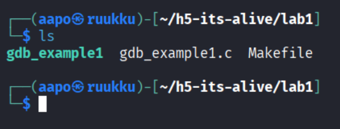

**Kuva 1.** Hakemistossa oli kolme erilaista tiedostoa

Varmistin vielä lähdekoodin tiedoston olevan C-kielellä file työkalullakin.

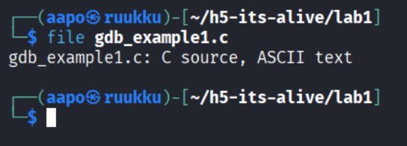

**Kuva 2.** Tiedosto oli C-kielellä file työkalunkin mukaan

Ajoin ohjelman nähdäkseni mikä on sen lopputulos.

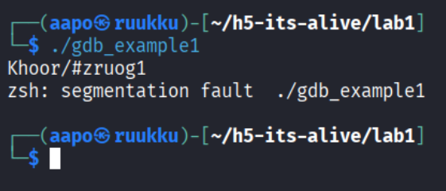

**Kuva 3.** Ohjelman virhe

Ohjelmassa oli jokin virhe, joten lähdin GNU Debuggerin kanssa selvittämään sitä. Loin debug tiedoston komennolla

```bash
$ gcc gdb_example1.c -g -Wall -Werror -o gdb_example1-dbg #gcc on kääntäjä, -g valinta lisää debug tietoja, -Wall valinta ottaa käyttöön kaikki kääntäjän yleiset varoitukset, -Werror valinta muuttaa kaikki varoitukset virheiksi kääntäjässä
```

(Valintojen lähteinä kurssin materiaali. Iso-Anttila, L.)

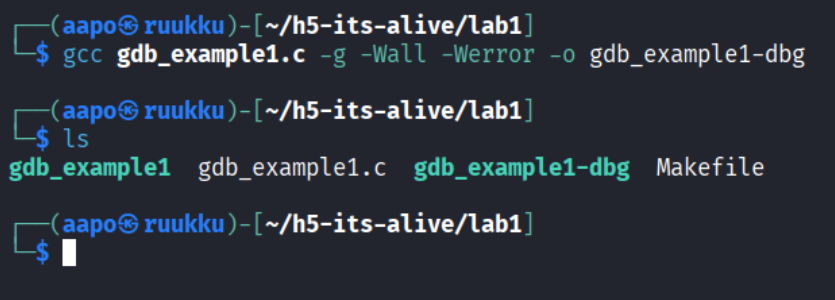

**Kuva 4.** Debug tiedoston luonti ja hakemiston listaaminen

Seuraavaksi ajoin tiedoston GNU Debuggerilla komennolla

```bash
$ gdb ./gdb_example1-dbg
```

<br>

**15.2.2026 18:51**

Aloitin asettamalla break kohdan main-funktioon.

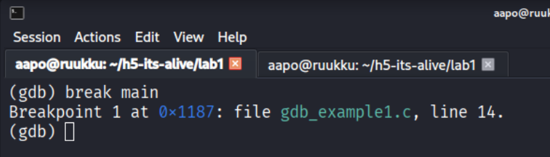

**Kuva 5.** Breakpoint asetettuna main-funktioon rivillä 14

Listasin lähdekoodin komennolla "list .", joka listaa käsiteltävän kohdan ja sen ympärillä olevia rivejä.

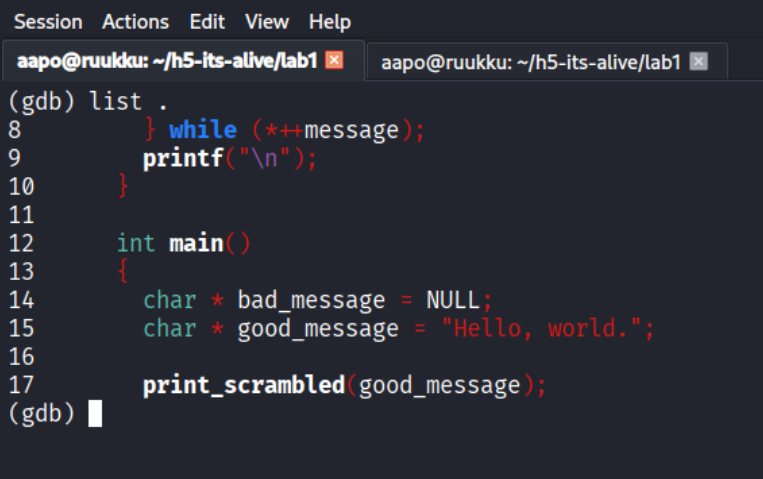

**Kuva 6.** Lähdekoodin listaus main-funktion ollessa breakpoint

Suoritin komentoja

```
(gdb) run #Ajaa ohjelman
(gdb) step #Hyppää koodin seuraavalle riville, hyppää myös funktioiden sisälle. Ajoin komentoa kunnes olin funktion print_scrambled sisällä
(gdb) finish #Ajaa funktion loppuun. Ajoin kaksi kertaa
```

Huomasin komentojen jälkeen samankaltaisen viestin, kuin binääriä ajettaessa.

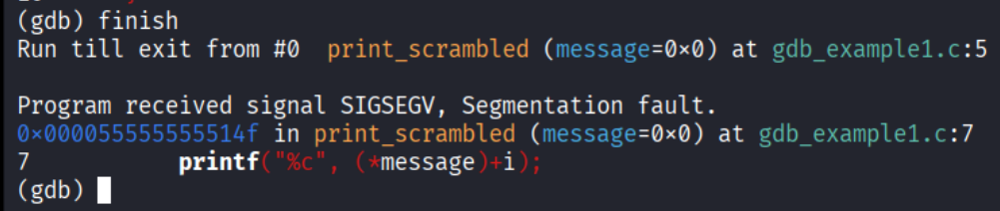

**Kuva 7.** Segmentointi virhe

Segmentointi virhe tuli suoritettaessa funktiota print_scrambled parametrillä bad_message main-funktiosta.

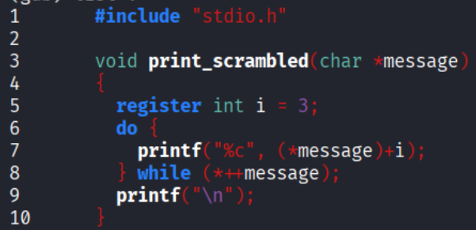

**Kuva 8.** Funktio print_scramble

Main-funktiossa bad_message muuttujan arvona oli NULL.

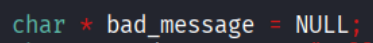

**Kuva 9.** Muuttujan bad_message arvossa voisi olla ongelma

Kokeilin ajaa "step" komentoa niin kauan kuin tulisi virhe. Virhe tuli jo ensimmäisellä kierroksella do-while silmukassa print_scramble funktiossa parametrillä bad_message. Kokeilin laittaa print_scramble funktiossa muuttujan message arvoksi "A", jonka jälkeen ei tullut virheilmoitusta. Muuttuja bad_messagen arvo "NULL" oli siis ongelmana.

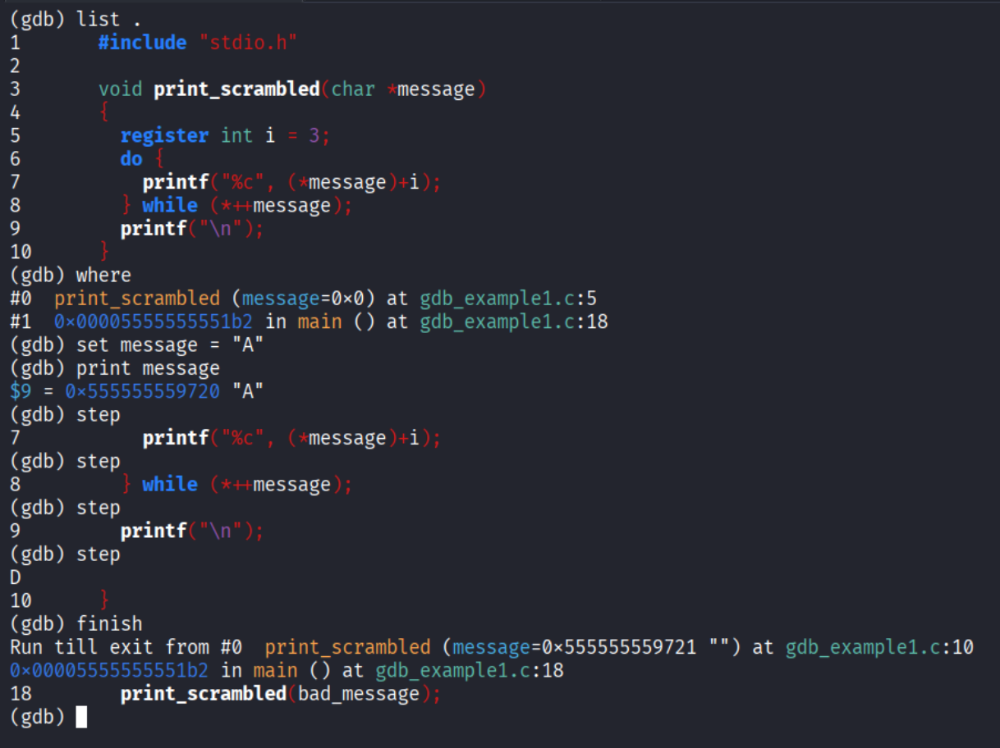

**Kuva 10.** Funktion ajaminen message muuttujan arvolla A

<br>

**15.2.2026 21:35**

Kävin muuttamassa lähdekoodiin muuttujan bad_message arvoksi "Moi".

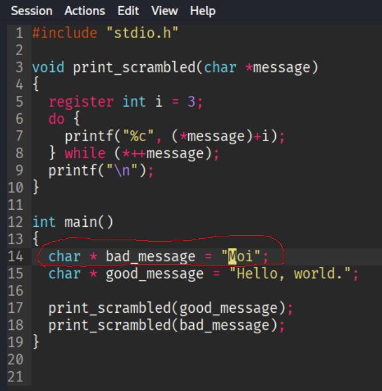

**Kuva 11.** Punaisella ympyröity muuttuja muutettuna

Ajoin tehtävän hakemistossa komennon, jolla sain käännettyä muunnetun lähdekoodin.

```bash
$ make #Kääntää koodin Makefile tiedoston mukaan
```

Tämän jälkeen ajoin ohjelman.

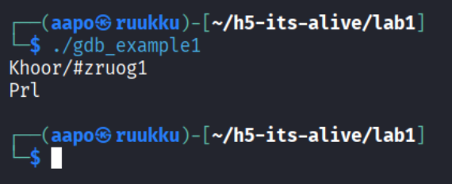

**Kuva 12.** Ohjelman sai ajettua ilman virheitä

Ihmettelin ohjelman lopputulosta, koska mielestäni sen olisi pitänyt tulostaa "Hello World" ja "Moi". Selvitin funktion print_scrambled silmukan sisältävän lausekkeen, joka siirtää kirjainta ASCII-merkeissä kolmella eteenpäin.

(Wikipedia. URL: [ASCII – Wikipedia](https://fi.wikipedia.org/wiki/ASCII))

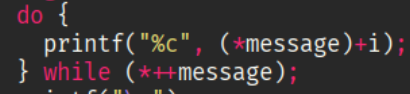

**Kuva 13.** Funktion print_scrambled silmukka

Muuttuja "i" oli alustettu arvoon 3, jolloin printf funktiossa kirjainta siirretään.

<br>

## b) Lab2. Find out the password and flag + write a report on how it opened. [lab2.zip](https://terokarvinen.com/application-hacking/lab2.zip)

**16.2.2026 16:24**

Tarkastin millaisia tiedostoja tehtävän hakemistossa oli.

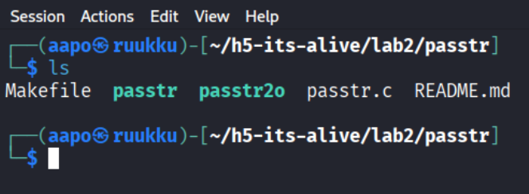

**Kuva 14.** Tehtävässä käytettävissä olevat tiedostot

Hakemistossa oli kaksi ajettavaa binääritiedostoa. Katsoin ensiksi niiden tietoja file työkalulla, jonka jälkeen ajoin ne.

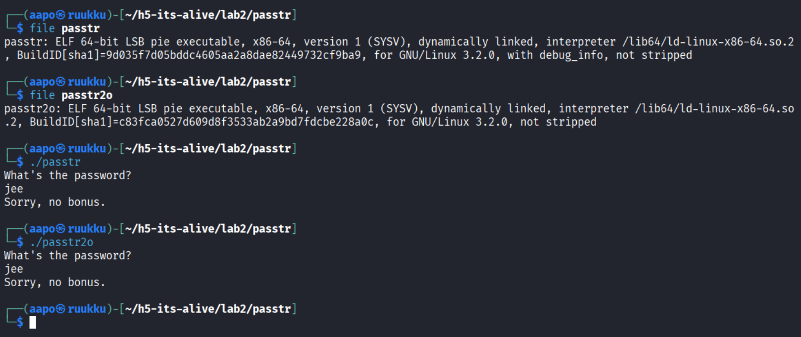

**Kuva 15.** Tiedostot olivat ELF-binäärejä ja ne kysyivät salasanaa

Tiedosto passtr taisi ollakin jo aikaisemmissa kurssin tehtävissä, mutta avasin sen taas stringsillä.

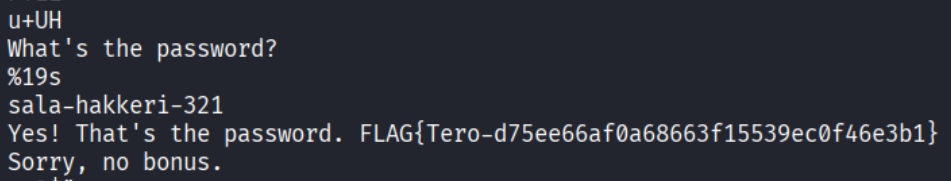

**Kuva 16.** Salasana ja lippu oli näkyvissä binääritiedostossa

Ajoin tiedoston ja laitoin salasanan.

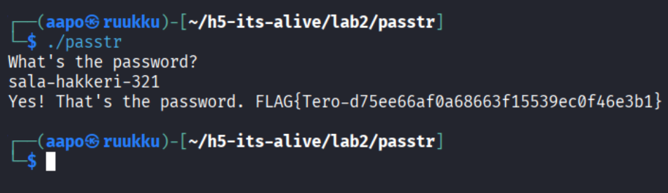

**Kuva 17.** Salasanalla tulostui lippu ohjelmaa ajettaessa

Salasana löytyi myös gdb:llä, koska tiedostossa oli debug-tietoja, kuten aikaisemmin file työkalun kanssa näkikin.

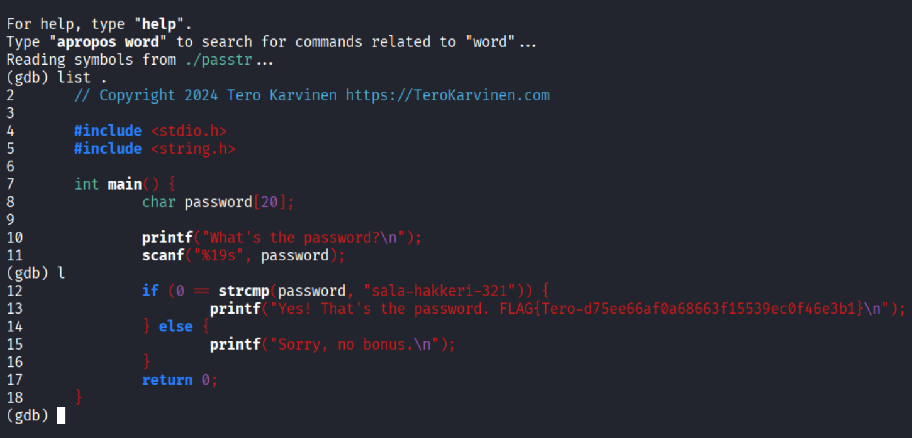

**Kuva 18.** Salasana ja lippu GNU Debuggerin avulla

<br>

**16.2.2026 16:45**

Tiedosto passtr2o olikin kinkkisempi, koska stringsillä ei saanut juuri mitään selville.

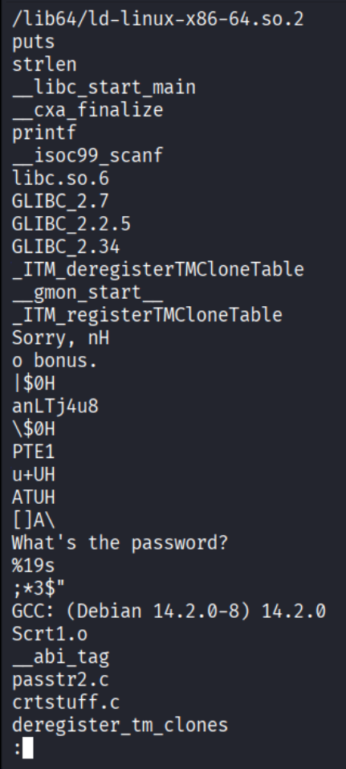

**Kuva 19.** Osa passtr2o tiedoston tulosteesta strings työkalulla

GNU Debuggerin kanssa ei myöskään auennut, koska passtr2o tiedostossa ei ollut debug-tietoja.

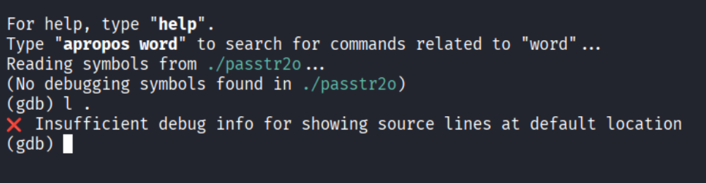

**Kuva 20.** Tiedostoa ei pystynyt tarkastelemaan gdb:llä

<br>

### Assembly koodi

Yritin etsiä tietoa netistä, miten saisin irti koodista jotain, vaikka minulla ei ollut lähdekoodia. Löysin komennon, jolla sain funktiot näkyviin.

(Stack Exchange Inc. URL: [c - Ask GDB to list all functions in a program - Stack Overflow](https://stackoverflow.com/questions/10680670/ask-gdb-to-list-all-functions-in-a-program))

```
(gdb) info functions
```

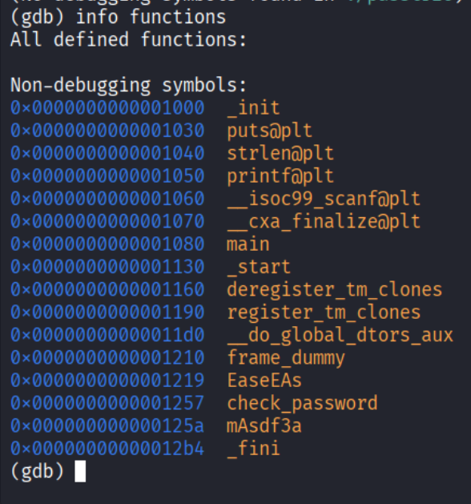

**Kuva 21.** Ohjelman funktiot

Löysin toisesta lähteestä komennon, jolla sai funktion assembly muotoon.

(CTF Handbook. URL: [Debuggers - CTF Handbook](https://ctf101.org/reverse-engineering/what-is-gdb/))

Laitoin assembly muotoon main funktion.

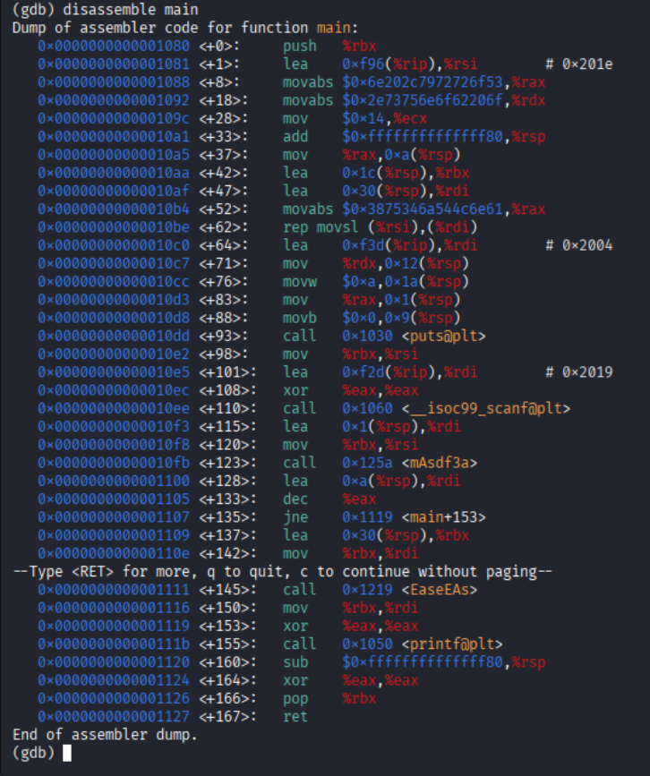

**Kuva 22.** Funktion main assembly koodi

Muutin myös check_password funktion assembly koodiksi, koska se vaikutti nimensä puolesta oleelliselta.

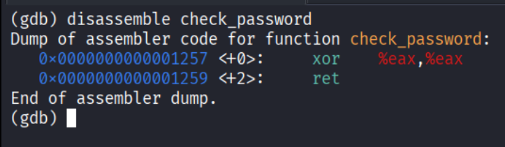

**Kuva 23.** Funktion check_password assembly koodi

Yritin asettaa erilaisiin funktioihin breakpointteja, mutta niistä ei tapahtunut mitään erikoista.

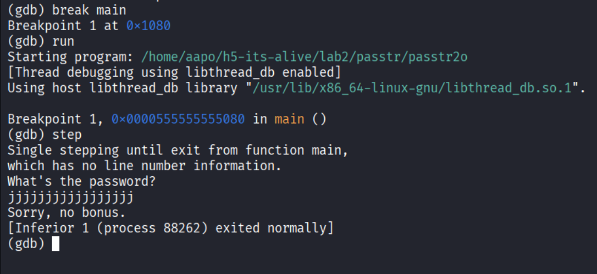

**Kuva 24.** Funktio main asetettu breakpointiksi

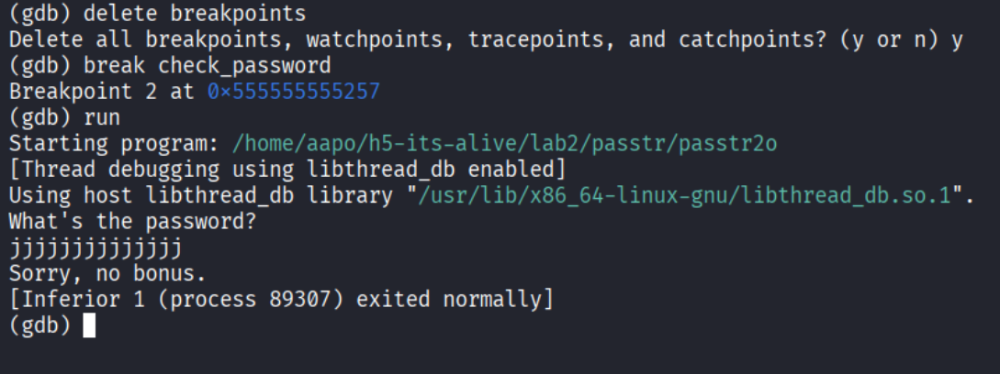

**Kuva 25.** Funktio check_password asetettuna breakpointiksi

<br>

### Rekisterit

Laitoin breakpointiksi funktion strlen, jolloin sain pysäytettyä ohjelman salasanan syöttämisen jälkeen. Tarkastelin rekistereitä, kun ohjelma oli ajossa, mutta odotti käskyä jatkaa salasanan syöttämisen jälkeen.

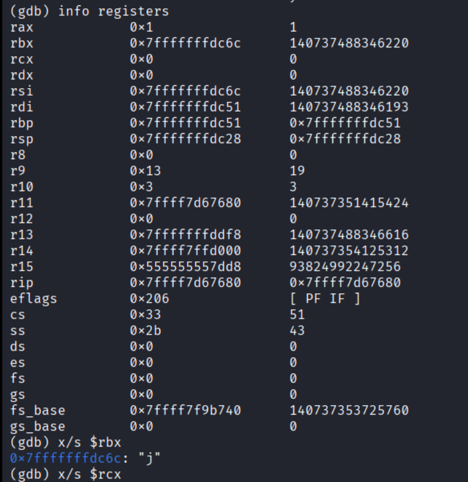

**Kuva 26.** Rekisterit ohjelman ollessa vielä käynnissä

Kokeilin aiemmin viittaamani CTF Handbookin ohjeiden mukaan saada rekistereistä tietoa ulos. Ajattelin salasanan mahdollisesti olevan jossain muistissa.

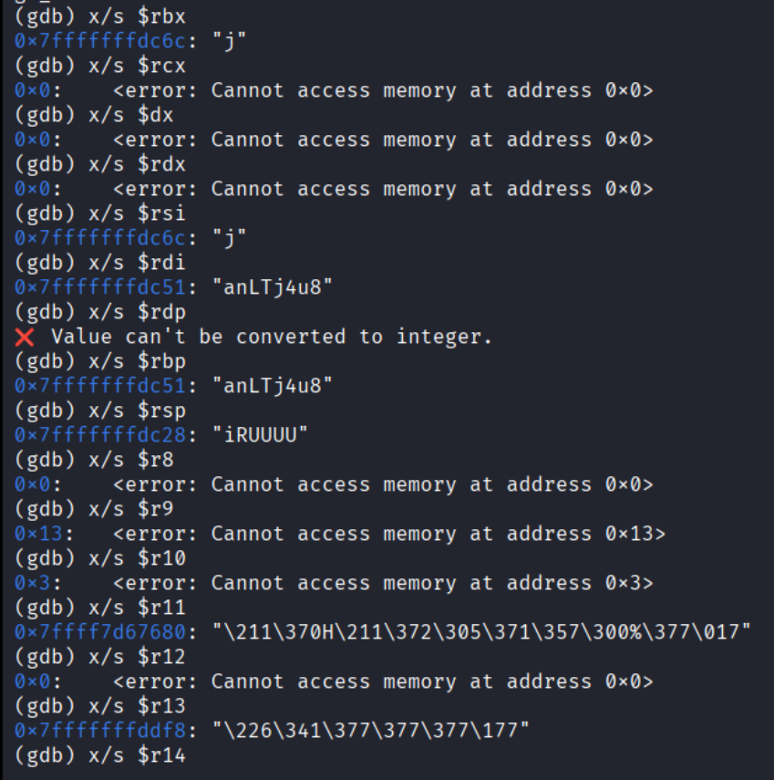

**Kuva 27.** Ensimmäinen osa rekisterien tarkastelussa

<br>

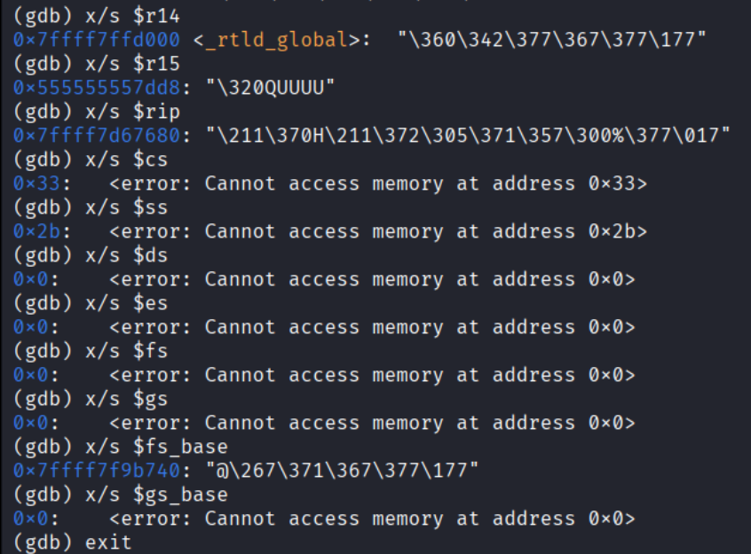

**Kuva 28.** Toinen osa rekisterien tarkastelussa

- Komennossa x/s
  
  - x = examine
  
  - s = string

(CTF Handbook)

Komento näytti siis merkkijonona rekisterin sisällön. Kokeilin salasanoja "anLTj4u8" ja "iRUUUU", koska ne esiintyivät rekistereissä ja ne vaikuttivat mahdollisesti salasanan kaltaisilta. Kumpikaan ei ollut kuitenkaan oikea salasana.

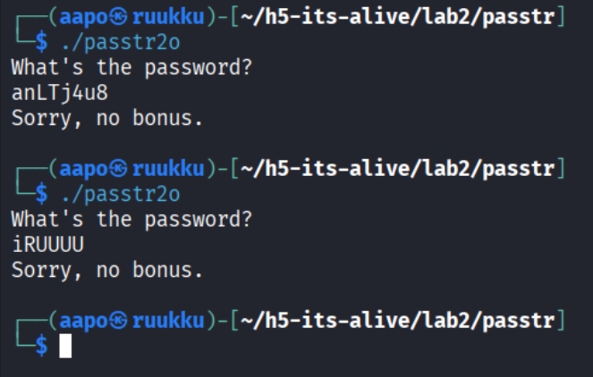

**Kuva 29.** Molemmat uudet sanat olivat vääriä salasanoja

Tässä vaiheessa jouduin toteamaan, että en keksinyt uusia lähestymistapoja enää tehtävän ratkaisemiseen, vaikka yritin etsiä netistä lisää tietoa. Olisin voinut toki koittaa Ghidran kanssa avata binäärin, mutta tehtävän README tiedostossa luki, että tehtävä olisi ratkaistava debuggerilla.

<br>

## c) Lab3. Try Nora Crackmes exercises tasks 3 and 4; the rest are optional. Tindall 2023: [NoraCodes / crackmes](https://github.com/NoraCodes/crackmes).

**16.2.2026 20:38**

Aloitin katsomalla millaisia tiedostoja hakemistossa oli.

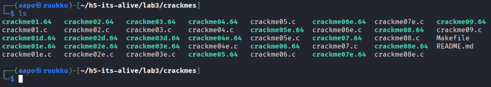

**Kuva 30.** Lab3 tehtävät

Oletin tehtävässä olevan tarkoituksena saada salasana binääristä debuggerilla. Avasin kuitenkin samalla tavalla gdb-ohjelmalla tiedoston crackme03.64, joka ei sisältänyt debug-tietoja. Funktiossa main huomasin toisen funktion nimeltä check_pw.

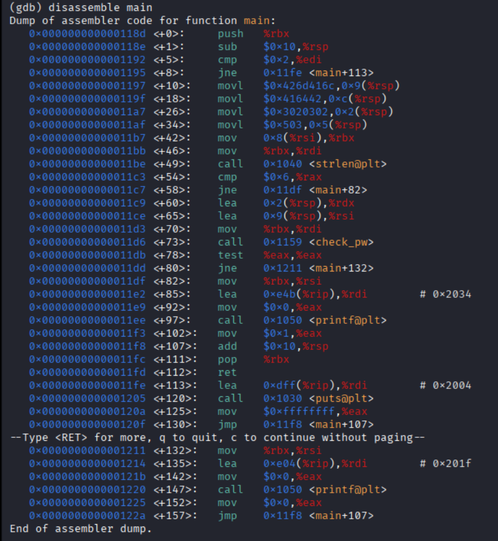

**Kuva 31.** Funktio main assembly koodina

Muutin assemblyksi funktion check_pw.

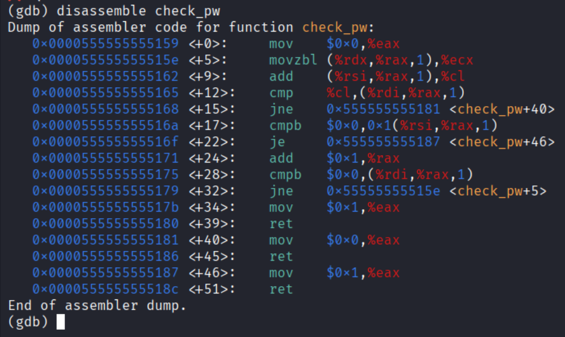

**Kuva 32.** Funktio check_pw assembly koodina

En kyllä osannut tätäkään lähestyä enää millään uudella tavalla. Lähdekoodi oli saatavissa, mutta olettaisin että tässä vaiheessa tulisi ratkaista vain binääristä.

Sama homma jatkui crackme04.64 tiedostossa.

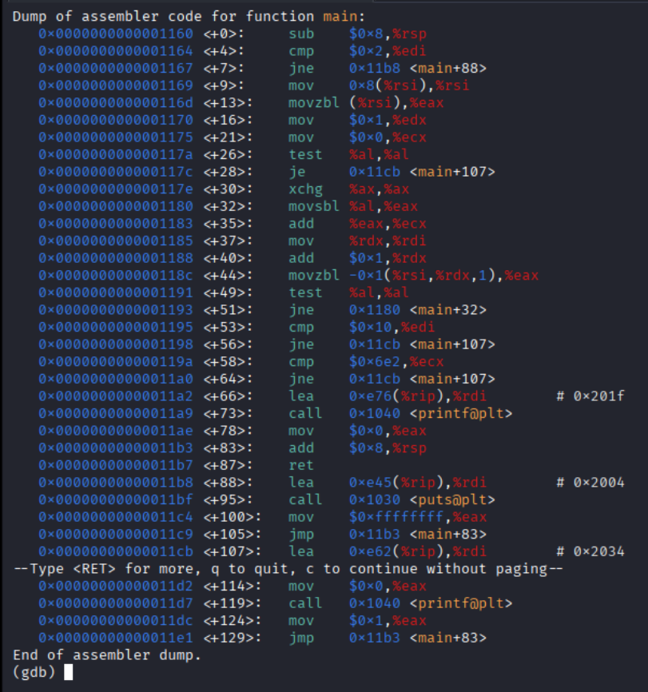

**Kuva 33.** Tiedoston crackme04.64 main funktio gdb:llä

<br>

## d) Lab4. Optional: [Crackmes.one](https://crackmes.one/) exercise. Can you find out the password? lab4.zip in Moodle.

En tehnyt kyseistä tehtävää, koska minulla oli kulunut jo niin kauan aikaa aikaisemmissa tehtävissä.

<br>

<br>

## Lähteet

CTF Handbook. 26.1.2024. Luettavissa: [Debuggers - CTF Handbook](https://ctf101.org/reverse-engineering/what-is-gdb/). Luettu: 16.2.2026.

Iso-Anttila, L. Kurssin materiaalit. GNU Debugger (GDB). Luettu: 15.2.2026.

Stack Exchange Inc. Luettavissa: [Ask GDB to list all functions in a program](https://stackoverflow.com/questions/10680670/ask-gdb-to-list-all-functions-in-a-program). Luettu: 16.2.2026.

Wikipedia 29.11.2024. ASCII. Luettavissa: [ASCII – Wikipedia](https://fi.wikipedia.org/wiki/ASCII). Luettu: 15.2.2026.

<br>

<br>

<br>

<br>

<br>

<br>

*Tätä dokumenttia saa kopioida ja muokata GNU General Public License (versio 3 tai uudempi) mukaisesti. http://www.gnu.org/licenses/gpl.html*
