# h6 Hardware hacking

*Tekijä: Aapo Tavio*

*Pohjana Tero Karvinen ja Lari Iso-Anttila 2026: Sovellusten hakkerointi ja haavoittuvuudet 2026 kevät, [Application hacking - 2026 Spring - English ICI012AS3AE-3001 and Finnish ICI012AS3A-3003](https://terokarvinen.com/application-hacking)*

<br>

## Käytettävän ympäristön ominaisuudet

- Host
  
  - Host PC: HP Laptop 15s-eq3xxx
  
  - OS: Ubuntu 24.04.4 LTS
  
  - Processor: AMD Ryzen™ 7 5825U with Radeon™ Graphics × 16
  
  - Memory: 16.0 GiB
  
  - NIC: Realtek Semiconductor Co., 802.11ax Wireless
  
  - Architecture: x86_64
  
  - Firmware version: F.20
  
  - Kernel Version: Linux 6.17.0-14-generic

- Virtual Machine
  
  - OS: Kali GNU/Linux Rolling
  
  - Release: 2025.4
  
  - Kernel Version: Linux 6.18.9+kali-amd64
  
  - Architecture: x86-64
  
  - Hardware Vendor: Qemu
  
  - Hardware Model: Standard PC *Q35 + ICH9, 2009*
  
  - Hardware Version: pc-q35-8.2
  
  - Firmware Version: 1.16.3-debian-1.16.3-2
  
  - Firmware Date: 2014-04-01

<br>

## 1. Decrypt firmware image

Aloitin lataamalla ja valmistelemalla tp-link-decrypt ohjelman valmiiksi sivuston ohjeiden mukaisesti osoitteesta [GitHub - robbins/tp-link-decrypt: Decrypt TP-Link Firmware](https://github.com/robbins/tp-link-decrypt). Tämän jälkeen latasin tiedostot "Tapo_C200v5_en_1.2.3.bin" ja "dump-tapo-c200v3-1.4.2.bin", jotka edustivat eri versioita tp-link kameroiden ohjelmistosta. Tein tehtävän versiosta 5, joten ts. tiedosto "Tapo_C200v5_en_1.2.3.bin" oli käsittelyssä.

Purin salauksen komennolla

```bash
$ bin/tp-link-decrypt Tapo_C200v5_en_1.2.3.bin #Purkaa salauksen hyödyntäen tp-link-decrypt ohjelmaa
```

Tuloksena tuli tiedosto "Tapo_C200v5_en_1.2.3.bin.dec".

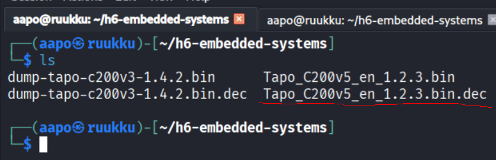

**Kuva 1.** Käsiteltävä dekryptattu tiedosto alleviivattu punaisella

<br>

## 2. Analyse the image file

Lähdin etsimään tietoa miten analysoida tiedostoa. Havaitsin työkalun nimeltä binwalk. Binwalk etsii binäärikuvasta (binary image) tiedostoja ja ajettavaa koodia.

(OffSec Services Limited 2025. URL: [Binwalk](https://www.kali.org/tools/binwalk/))

Ajoin komennon

```bash
$ binwalk -e Tapo_C200v5_en_1.2.3.bin.dec #Analysoi ja eristää kaikki tunnetut tiedostotyypit
```

(Binwalkin virallinen cli manuaali Kali Linuxilla. Komento: man binwalk)

Listasin hakemiston _Tapo_C200v5_en_1.2.3.bin.dec.extracted, josta löytyi squashfs-root hakemisto.

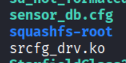

**Kuva 2.** Hakemisto eristettynä

Lisäksi samasta hakemistosta _Tapo_C200v5_en_1.2.3.bin.dec.extracted löytyi toinenkin root-hakemistoon viittaava tekijä, jonka ajattelin sisältävän mahdollisesti root-osion muistiosoitteen.

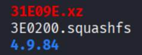

**Kuva 3.** Mahdollinen muistiosoite 3E0200

Katsoin lisäksi ilman eristämistä binwalkilla image-tiedostoa.

```bash
$ binwalk Tapo_C200v5_en_1.2.3.bin.dec
```

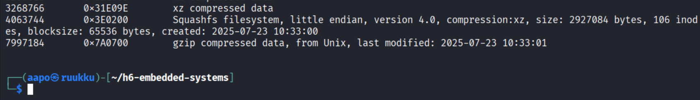

**Kuva 4.** Osa tulosteesta yllä olevaan komentoon

Siellä näkyi sama muistiosoite.

<br>

## 3. Extract rootfs from the dump file

Tein kohdan neljä, joka vastaa tätä kohtaa, mutta eri versiota hyödyntäen.

<br>

## 4. Extract rootfs from the image file

Eristin dd-työkalulla root-osion komennolla

```bash
$ dd if=Tapo_C200v5_en_1.2.3.bin.dec of=fs.squashfs bs=4096 skip=992 #if on input file, of on output file, bs on block size, skip kertoo kuinka monta blokkia on hypättävä yli
```

(Kaplarevic 2025. URL: [Linux dd Command (17 Practical Examples](https://phoenixnap.com/kb/linux-dd-command))

Sain pähkäiltyä ChatGPT:n avulla bs arvoksi 4096 ja skip arvoksi 992, koska offset oli 0x3E0200 eli desimaalilukuna 4 063 744. Tämän johdosta 4063744 / 4096 = 992. 4096 tavua(B) on 4 Kilotavua(KB).

(ChatGPT. Kielimalli: GPT-5 Mini. Syöte: what is this 4063744 / 4096 = 992)

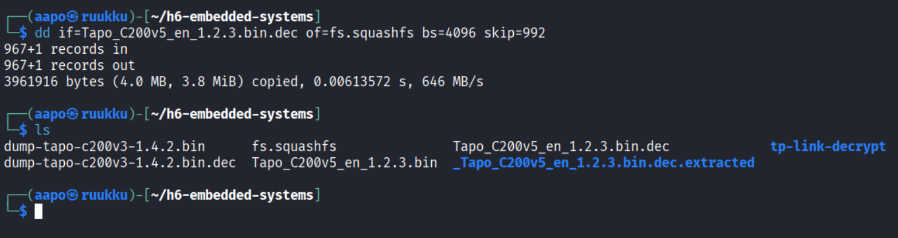

**Kuva 5.** Root-osion eristäminen ja hakemisto listattuna

Katsoin eristettyä tiedostoa less-työkalulla, mutta mitään erikoista sieltä ei osunut silmääni.

```bash
$ less fs.squashfs
```

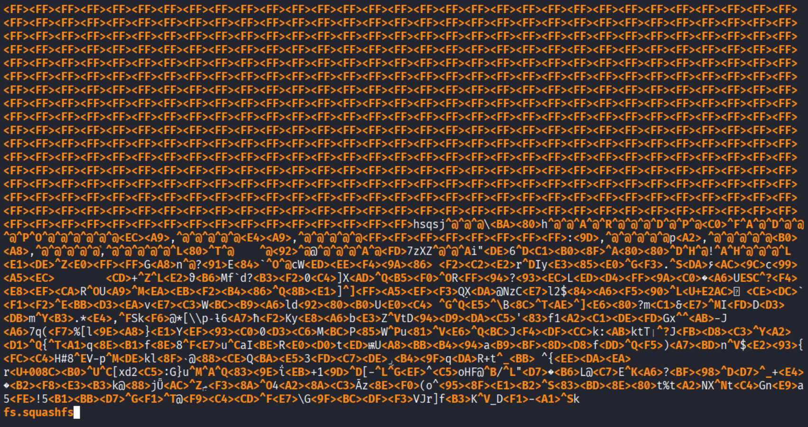

**Kuva 6.** Osa tiedostosta fs.squashfs

Kokeilin stringsillä grepata sanoja "root" ja "pass" tuloksetta.

Seuraavaksi kokeilin hakea "root" tekstiä aikaisemmin binwalkilla eristetystä tiedostosta _Tapo_C200v5_en_1.2.3.bin.dec.extracted, koska siellä oli hakemisto /etc, mutta passwd tai shadow alihakemistoa ei kuitenkaan ollut, joista olisi voinut suoraan saada salasanan. Olin hakemistopolussa /home/aapo/h6-embedded-systems/_Tapo_C200v5_en_1.2.3.bin.dec.extracted ajaessani komennon.

```bash
$ grep -Rni --text "root" . | less #R valinta tarkastaa kaikki tiedostot rekursiivisesti hakemistoista ja seuraa symbolisia linkkejä, n valinta lisää rivinumerot tulosteeseen, i valinta ottaa huomioon suuret sekä pienet kirjaimet
```

(Grep työkalun virallinen cli manuaali Kali Linuxissa. Komento: man grep)

Tuloksena sain johtolangan tulosteesta.

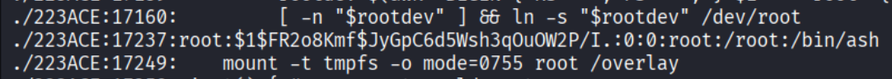

**Kuva 7.** Root käyttäjän mahdollinen salasana tiivisteenä

Mahdollinen salasanan tiiviste löytyi, koska syntaksi vastasi linuxin salasanatiedostossa olevaa syntaksia. Löysin tiivisteen vielä toisestakin kohdasta samasta tulosteesta.

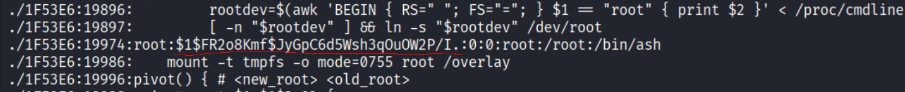

**Kuva 8.** Toisessa paikassa tulostetta sama salasanan tiiviste

Oletin kyseessä olevan tiiviste, koska \$1$ tarkoittaa MD5 tiivisteen käyttöä salasanassa. Lisäksi salasana oli suolattu joka oli tapauksessa \$FR2o8Kmf$.

(Panovski 2026. URL: [Understanding the /etc/shadow File in Linux | Linuxize](https://linuxize.com/post/etc-shadow-file/))

<br>

## 5. Search Available applications

## &

## 6. Analyse and try to open root password

Yritin John the ripper ohjelman avulla suorittaa salasanaa vasten brute-force metodilla murron. Käytin sanalistana rockyou.txt tiedostoa, joka löytyi valmiina Kali distrosta. John yrittää verrata murrettavaa salasanaa toisinsanoen rockyou.txt tiedostosta löytyviin merkkijonoihin.

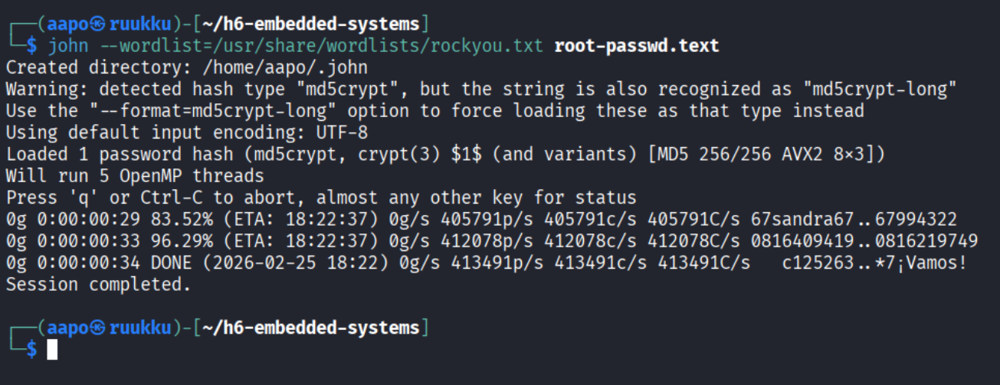

**Kuva 9.** John the ripperin käyttö

Menin tarkastamaan löytyikö salasana, mutta niitä ei löytynyt.

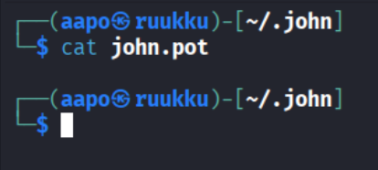

**Kuva10.** Salasanoja ei löytynyt tiedostosta john.pot

Yritin vielä ilman sanalistaa murtaa salasanaa johnin oletus asetuksilla, mutta lopetin n. 15min jälkeen, koska osumia ei ollut löytynyt.

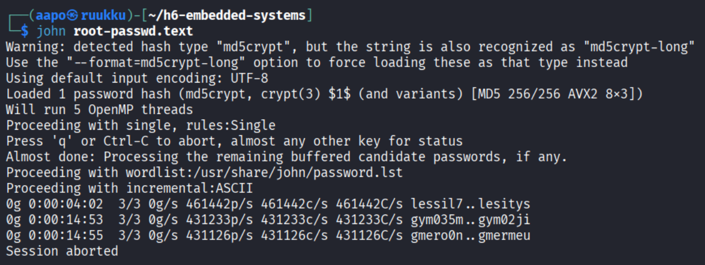

**Kuva 11.** Brute-force yritys johnin oletus asetuksilla

<br>

<br>

## Lähteet

Binwalkin virallinen cli manuaali Kali Linuxilla. Komento: man binwalk. Luettu: 26.2.2026.

ChatGPT. Kielimalli: GPT-5 Mini. Syöte: what is this 4063744 / 4096 = 992. Generoitu web-sovelluksessa Brave-selaimella 26.2.2026.

Grep työkalun virallinen cli manuaali Kali Linuxissa. Komento: man grep. Luettu: 26.2.2026.

Kaplarevic, V. 12.12.2025. Linux dd Command. Luettavissa: [Linux dd Command (17 Practical Examples)](https://phoenixnap.com/kb/linux-dd-command). Luettu: 26.2.2026.

OffSec Services Limited. 9.12.2025. Binwalk. Luettavissa: [Binwalk](https://www.kali.org/tools/binwalk/). Luettu: 26.2.2026.

Panovski, D. 18.2.2026. Understanding the /etc/shadow File in Linux. Luettavissa: [Understanding the /etc/shadow File in Linux | Linuxize](https://linuxize.com/post/etc-shadow-file/). Luettu: 26.2.2026.

<br>

<br>

<br>

<br>

<br>

<br>

*Tätä dokumenttia saa kopioida ja muokata GNU General Public License (versio 3 tai uudempi) mukaisesti. http://www.gnu.org/licenses/gpl.html*
