# h7 Uhagre2

*Tekijä: Aapo Tavio*

*Pohjana Tero Karvinen ja Lari Iso-Anttila 2026: Sovellusten hakkerointi ja haavoittuvuudet 2026 kevät, [Application hacking - 2026 Spring - English ICI012AS3AE-3001 and Finnish ICI012AS3A-3003](https://terokarvinen.com/application-hacking/#h7-uhagre2-tero)*

<br>

## Käytettävän ympäristön ominaisuudet

- Host
  
  - Host PC: HP Laptop 15s-eq3xxx
  
  - OS: Ubuntu 24.04.4 LTS
  
  - Processor: AMD Ryzen™ 7 5825U with Radeon™ Graphics × 16
  
  - Memory: 16.0 GiB
  
  - NIC: Realtek Semiconductor Co., 802.11ax Wireless
  
  - Architecture: x86_64
  
  - Firmware version: F.20
  
  - Kernel Version: Linux 6.17.0-14-generic

- Virtual Machine
  
  - OS: Kali GNU/Linux Rolling
  
  - Release: 2025.4
  
  - Kernel Version: Linux 6.18.9+kali-amd64
  
  - Architecture: x86-64
  
  - Hardware Vendor: Qemu
  
  - Hardware Model: Standard PC _Q35 + ICH9, 2009_
  
  - Hardware Version: pc-q35-8.2
  
  - Firmware Version: 1.16.3-debian-1.16.3-2
  
  - Firmware Date: 2014-04-01

<br>

## x) Read/watch/listen and summarize. (In this x-subsection, you don't need to do tests on a computer; just reading or listening and a summary is enough. A few bullet points are sufficient for the summary.)

- Koodi ja salateksti (ciphertext) ovat kaksi eri asiaa

- XOR = exclusive-or operation
  
  - Todella heikko salaustekniikka

(Schneier 2015. Osat 1.1,1.4)

<br>

- Yksinkertaisiin ohjelmiin kannattaa käyttää pythonia cli:n kautta

- Assert, breakpoint- ja print-funktio ovat hyviä debuggaukseen

- XOR on yleinen salauksessa

- Bitwise operaatiossa käsitellään syötteen bittejä jollakin tavalla

(Karvinen 2024)

<br>

## Solve [CryptoPals Set 1](https://cryptopals.com/sets/1) challenges. Tasks can be solved with any programming language and using any text editor or IDE. Tasks shouldn't be solved with AI, as it just copies the model solution directly from its training material.

<br>

## a) 1. Convert hex to base64.

Tein tämän kohdan jo aikaisemmassa harjoituksessa h3 No Strings Attached, joten kopioin tehtävän tähän dokumenttiin h3:sta.

**30.1.2026 16:42**

Lähdin tekemään tehtävää ja ensimmäiseksi huomasin sivun alalaidassa olevan maininta, jonka mukaan aina pitäisi käsitellä raaka tavuja. Tehtävänannossa oli hexa merkkijono ja base64 merkkijono (Cryptopals. URL: [Challenge 1 Set 1 - The Cryptopals Crypto Challenges](https://www.cryptopals.com/sets/1/challenges/1)).

Lähdin selvittelemään asiaa ja ChatGPT antoi mielestäni selkeimmän vastauksen. Tai oikeastaan ainoan, josta sain selvää.

Selvitin raakatavujen, hexojen, binäärien ja base64 suhdetta toisiinsa syötteellä "tell me relation of raw bytes, hex, binaries and base64".

(ChatGPT. Kielimalli: GPT-5.2)

Vastauksessaan tekoäly sanoi raakatavujen olevan alinta ja "oikeaa" dataa. Tämän jälkeen tulivat binääri, jonka kantaluku on 2. Heksojen kantaluku on 16 ja base64 kantaluku on 64. Tein vastauksesta piirustuksen ja liitin sen tähän. Ehkä voi jotain toistakin joskus auttaa hahmottamisessa.

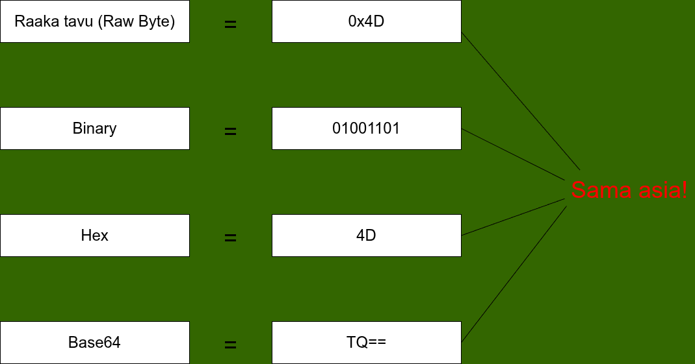

**Kuva 1.** Sama arvo esitetty neljässä eri muodossa

Lisäksi kysyin "what is 0x in raw bytes". Tekoäly vastasi sen olevan vain helpottamaan raakatavun tulkintaa ihmiselle. Etuliitteestä 0x näkee, että kyseessä on raakatavu.

Kysyin vielä kolmannen kysymyksen, joka oli "how can i convert raw bytes to base64". ChatGPT vastasi, että minun oli muutettava ensin heksat binääriksi, jonka jälkeen ne olisi jaoteltava kuuden bitin paloiksi, koska base64 ottaisi binäärit tässä muodossa. Lisäksi AI kertoi linuxilla olevan xxd niminen ohjelma, jolla voisi kääntää raakatavut, ja heksat, base64-muotoon.

Löysin lisää ohjeita xxd-ohjelmasta.

(Stack Exchange Inc. URL: [encoding - How can I convert from hex to base64? - Super User](https://superuser.com/questions/158142/how-can-i-convert-from-hex-to-base64))

Sain ainakin suoraan heksoista base64 merkkijonon, joka oli tehtävänannossakin.

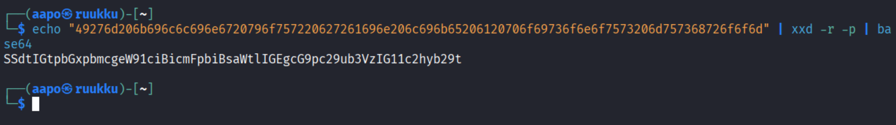

**Kuva 2.** Heksat käännettynä base64-muotoon

Valinta -r tarkoittaa käänteistä (revert), eli hexat käännetään binääriksi. Valinta -p puolestaan tarkoittaa "plain" tekstiä.

(xxd virallinen manuaali Kali Linuxilla. Komento: man xxd)

En löytänyt oikein tietoa, miten saisin käännettyä raakatavut base64-muotoon. Ajattelin ehkä tajunneeni asian vain väärin. Sinänsähän hexat, joita käsittelin, olivat raakatavuja. Merkkijono olisi pitänyt vain tavuttaa kahden heksan osiin ja lisätä 0x eteen. Ehkä tämä oli tapa, jolla tehtävä kuuluikin tehdä.

<br>

## b) 2. Fixed XOR.

**6.3.2026 09:47**

Ajattelin ensimmäiseksi lähestyä tehtävää luomalla muuttujat alkuperäiselle merkkijonolle ja merkkijonolle jota vastaan suoritetaan xor operaatio. Tämän jälkeen print-funktiolla tulostaisin ne ja samalla suorittaisin xor operaation.

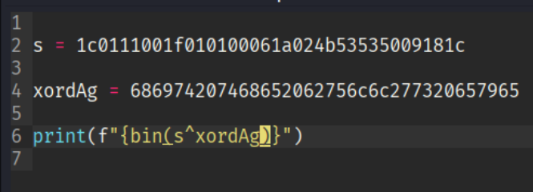

**Kuva 3.** Luotu koodi

Ajoin tiedoston, mutta sain virheilmoituksen.

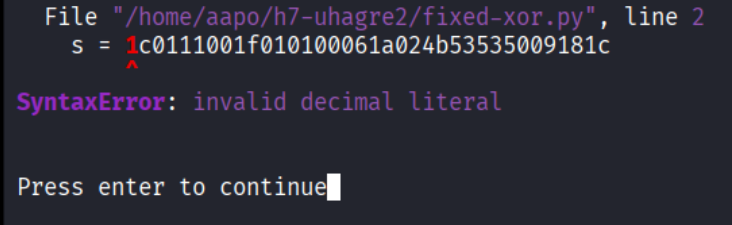

**Kuva 4.** Virheilmoitus koodia ajettaessa

Huomasin tässä vaiheessa, että minullahan oli aivan väärässä muodossa muuttujat.

Kokeilujen ja tiedon etsimisen jälkeen sain oikean vastauksen.

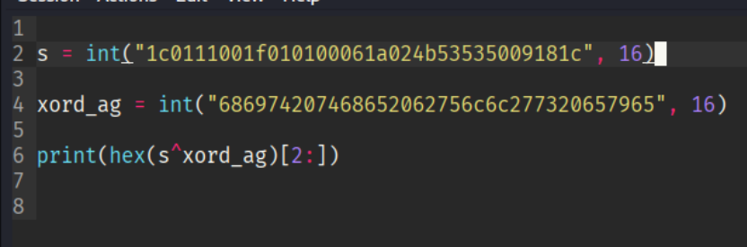

**Kuva 5.** Ensimmäinen versio oikeanlaisesta koodista

Koodissa s-muuttujaan asetetaan arvo "1c0111001f010100061a024b53535009181c", joka muutetaan merkkijonosta kokonaisluvuksi. Numero 16 pilkun jälkeen tarkoittaa, että merkkijono esittää lukua, jonka kantaluku on 16. Ts. heksadesimaaliluku. Samanlainen operaatio tehdään muuttujalle xord_arg.

(Garg 2025. GeeksforGeeks. URL: [Python - Ways to convert hex into binary - GeeksforGeeks](https://www.geeksforgeeks.org/python/python-ways-to-convert-hex-into-binary/))

Lopulta print-funktiossa tehdään bittikohtainen xor operaatio (bitwise xor operation) kokonaisluvuille muuttujissa s ja xord_ag. Bittikohtainen xor operaatio suoritetaan "caret" merkillä.

(VasuDeos. GeeksforGeeks. URL: [VasuDeoS - Indian Institute of Technology Kanpur (IIT Kanpur) | GeeksforGeeks Profile](https://www.geeksforgeeks.org/profile/vasudev4))

Samalla käytetään pythonin hex-funktiota, jolla muutetaan xor operaatiosta tuleva luku heksadesimaaliksi. Lopulta merkintä [2:] poistaa tulosteesta  "0x", joka tulee automaattisesti muutettaessa kokonaislukua heksadesimaaliksi.

(Khan 2025. GeeksforGeeks. URL: [Python Program to Convert Binary to Hexadecimal - GeeksforGeeks](https://www.geeksforgeeks.org/python/python-program-to-convert-binary-to-hexadecimal/))

<br>

**6.3.2026 11:26**

Tehtävänannossa käskettiin tehdä funktio, joka ottaa kaksi yhtä suurta puskuria ja tekee niistä XOR yhdistelmän. Tein vielä siis lisäykset koodiin, joilla sain käyttäjältä kaksi syötettä, vertailin niiden pituutta keskenään ja erillisen funktion vertailulle ja xor operaatiolle. Syötteiden ottamisen ja tuloksen tulostamisen tein main-funktioon.

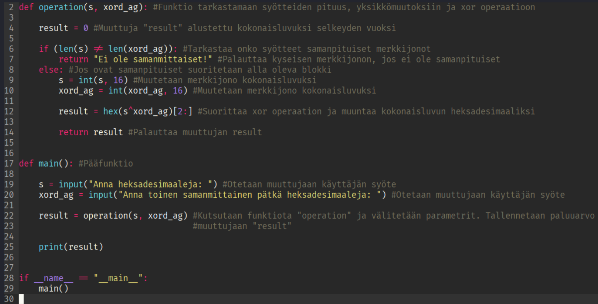

**Kuva 6.** Lopullinen koodi

Koodin kommenteilla on selitetty koodin toimintaa kuvassa. Lopussa oleva if-lauseke

```python
if __name__ == "__main__":
    main()
```

asettaa muuttujan oikein pythonin tulkatessaan tiedostoa. Minulle opetettiin pythonin perusteet kurssilla, että tämä on hyvä laittaa jos on useampi funktio tiedostossa. Lisätietoa saa Stack Exchang:n sivulta (URL: [What does if __name__ == "__main__": do?](https://stackoverflow.com/questions/419163/what-does-if-name-main-do))

Ajoin tiedoston toteakseni sen toimivan.

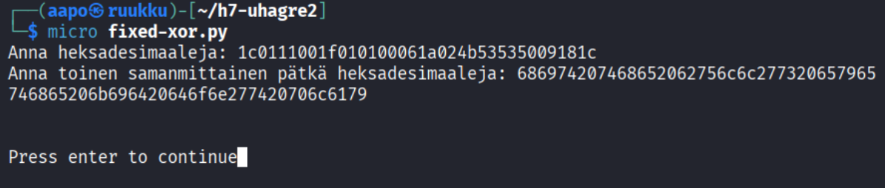

**Kuva 7.** Ohjelma toimi kuten pitikin

Tarkistin vielä, että tulosteena saatu heksadesimaali vastasi cryptopals sivuston vastauksen heksadesimaalia. Käytin tarkastukseen luomaani bash-koodia tiivisteiden tarkastamiseen. Koodi toimii minkä vain kahden merkkijonon tarkasteluun.

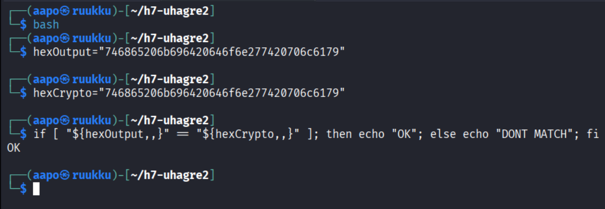

**Kuva 8.** Heksadesimaalien yhteneväisyyden tarkastus

Tulosteena tuli "OK", joka merkitsi heksojen olevan samanlaiset, muutoin tulosteena olisi tullut "DONT MATCH".

<br>

## c) 3. Single-byte XOR cipher.

**6.3.2026 20:21**

Lähdin ensiksi tekemään koodia joka lajittelisi frekvenssin mukaan merkit.

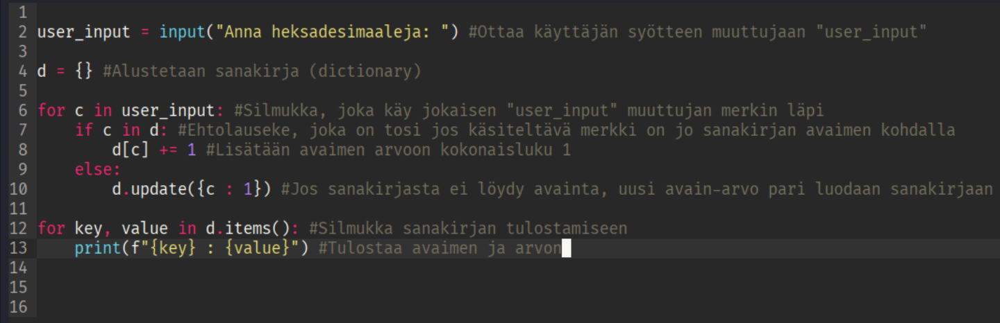

**Kuva 9.** Python ohjelma laskemaan merkkien esiintyvyyttä

Kuvassa on kommentteina selitetty koodin toiminta.

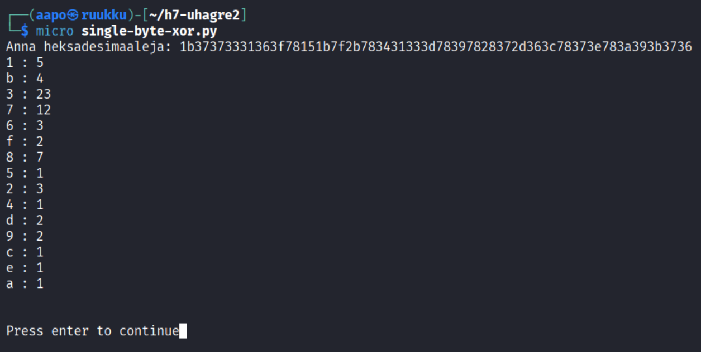

**Kuva 10.** Ohjelman ajaminen

<br>

**7.3.2026 12:38**

Etsin tietoa netistä n. 4-5h ja yritin hahmottaa, miten muuntaisin heksadesimaalit tavuiksi tai biteiksi, jonka jälkeen suorittaisin xor operaation. Xor operaation jälkeen muuttaisin takaisin tavut tai binäärit utf-8 muotoon. Lisäksi olisi pisteytettävä selkotekstistä kirjaimet "ETAOIN SHRDLU etaoin shrdlu", jonka jälkeen ne olisi järjestettävä pisteiden mukaan ja tulostettava käytetty avain(tavu) sekä avaimen viereen selkotekstinen teksti.

Yritin erilaisia koodeja paljon, mutta pääsin lähimmäksi alla olevalla koodilla.

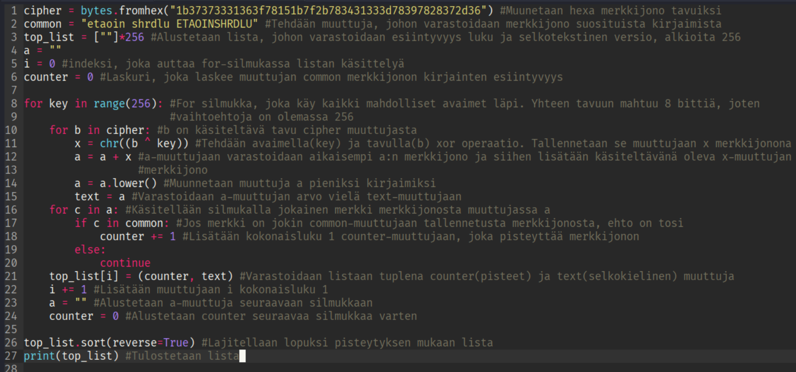

**Kuva 11.** Paras tuottamani koodi tehtävään

Koodin kommenteissa on selostettu tulkintani koodista.

Ajoin koodin komennolla

```bash
$ python3 test2-single-byte-xor.py | less
```

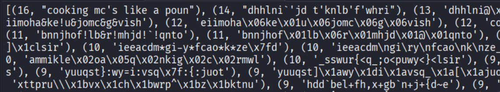

**Kuva 12.** Tuloste ohjelman ajamisen jälkeen

Kuten kuvasta ilmenee, korkeimman sijoituksen sai kokonaisluvulla 16 lause "cooking mc's like a poun". Tarkistin tekoälyn avulla, että oikea vastaus olisi "Cooking MC's like a pound of bacon". Toisinsanoen sain vain osan oikeasta lauseesta. Minun olisi myös pitänyt käsitellä jotenkin isoja kirjaimia ja pieniä kirjaimia eri tavalla, koska minun koodini tuotti vain pieniä kirjaimia.

Ongelma koodissani oli todennäköisesti for-silmukassa, joka kerää text-muuttujaan merkkejä, koska tulosteessani loppuosa puuttuu oikeasta lauseesta.

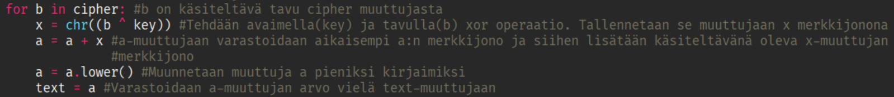

**Kuva 13.** Silmukka jossa uskoin ongelman olevan

Minulla oli kulunut jo niin kauan aikaa tehtävään ja aika alkoi loppumaan, joten siirryin neljänteen tehtävään.

<br>

## d) 4. Detect single-character XOR.

**7.3.2026 17:15**

En osannut muuta kuin muuttaa aiempaa koodia hieman erilaiseksi, jonka jälkeen yritin syöttää käyttäjän syötteenä tiedostossa olevat heksat. Syötteenä ei kuitenkaan voinut antaa tehtävän heksoja, koska kone meni suorastaan sekaisin. Tehtävän tiedoston heksoja taisi olla liian paljon.

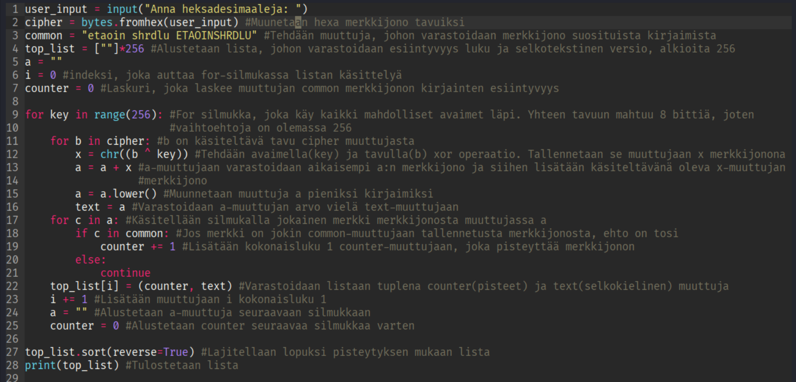

**Kuva 14.** Uusi koodi

Muutin koodin alkuun vain syötteen kautta tapahtuvan heksojen syöttämisen aiemman kovakoodatun heksan sijaan.

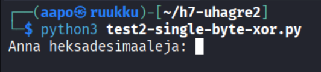

**Kuva 15.** Ohjelma kysyi käyttäjän syötettä ajettaessa

<br>

<br>

## Lähteet

ChatGPT. Kielimalli: GPT-5.2. Syöte: how can i convert raw bytes to base64. Generoitu: 30.1.2026.

ChatGPT. Kielimalli: GPT-5.2. Syöte: tell me relation of raw bytes, hex, binaries and base64. Generoitu: 30.1.2026.

ChatGPT. Kielimalli: GPT-5.2. Syöte: what is 0x in raw bytes. Generoitu: 30.1.2026.

Cryptopals. Convert hex to base64. Luettavissa: [Challenge 1 Set 1 - The Cryptopals Crypto Challenges](https://www.cryptopals.com/sets/1/challenges/1). Luettu: 30.1.2026.

Garg, A. 12.7.2025. GeeksforGeeks. Python - Ways to convert hex into binary. Luettavissa: [Python - Ways to convert hex into binary - GeeksforGeeks](https://www.geeksforgeeks.org/python/python-ways-to-convert-hex-into-binary/). Luettu: 6.3.2026.

Karvinen, T. 2.12.2024. Python Basics for Hackers. Luettavissa: [Python Basics for Hackers](https://terokarvinen.com/python-for-hackers/). Luettu: 5.3.2026.

Khan, S. 23.7.2025. GeeksforGeeks. Python Program to Convert Binary to Hexadecimal. Luettavissa: [Python Program to Convert Binary to Hexadecimal - GeeksforGeeks](https://www.geeksforgeeks.org/python/python-program-to-convert-binary-to-hexadecimal/). Luettu: 6.3.2026.

Schneier, B. 2015. Applied Cryptography: Protocols, Algorithms and Source Code in C, 20th Anniversary Edition. John Wiley & Sons, Inc. Indianapolis.

Stack Exchange Inc. How can I convert from hex to base64?. Luettavissa: [encoding - How can I convert from hex to base64? - Super User](https://superuser.com/questions/158142/how-can-i-convert-from-hex-to-base64). Luettu: 30.1.2026.

Stack Exchange Inc. What does if __name__ == "__main__": do?. Luettavissa: [What does if __name__ == "__main__": do?](https://stackoverflow.com/questions/419163/what-does-if-name-main-do). Luettu: 6.3.2026.

VasuDeos. 23.7.2025. GeeksforGeeks. XOR of Two Variables in Python. Luettavissa: [XOR of Two Variables in Python - GeeksforGeeks](https://www.geeksforgeeks.org/python/get-the-logical-xor-of-two-variables-in-python/). Luettu: 6.3.2026.

Xxd virallinen manuaali. Kali Linux. Komento: man xxd. Luettu: 30.1.2026.

<br>

<br>

<br>

<br>

<br>

<br>

*Tätä dokumenttia saa kopioida ja muokata GNU General Public License (versio 3 tai uudempi) mukaisesti. http://www.gnu.org/licenses/gpl.html*
